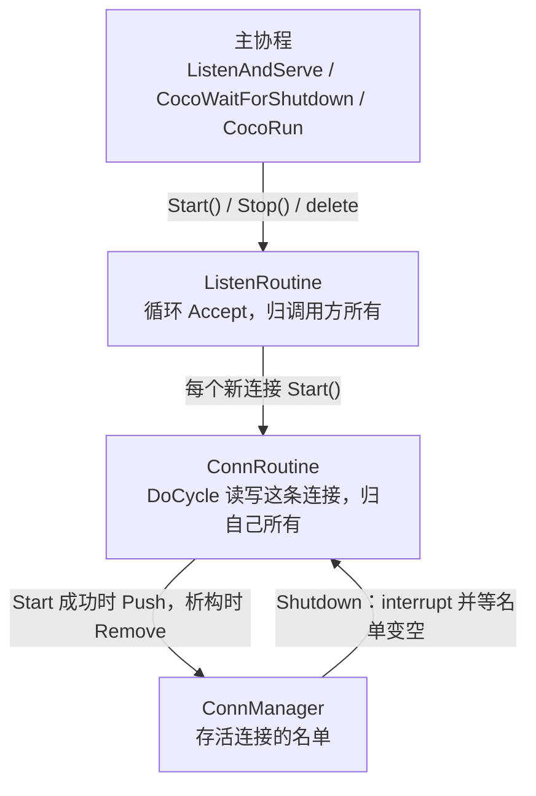

# 协程与连接管理

coco 的并发模型是：一个操作系统线程上跑很多栈式协程。阻塞点不进内核睡眠，而是让出当前协程，由 State Threads（ST）在 epoll（Linux）或 kqueue（macOS）上等到 I/O 就绪再切回来。业务代码写成普通的顺序调用。

这篇讲使用规则。ST 内部怎么调度、`Cycle()` 怎么被调用到、`CoCoroutine` 各个状态字段的含义，见 [State Threads 与 src/coco/base 的实现](st.md)。

相关代码：

- `src/coco/base/coroutine.hpp`、`src/coco/base/coroutine.cpp`：`CoCoroutine`、`ListenRoutine`、`ConnRoutine`
- `src/coco/base/coroutine_mgr.hpp`、`src/coco/base/coroutine_mgr.cpp`：`ConnManager`
- `src/coco/net/socket.cpp`：`st_read` / `st_write` 的封装
- `src/coco/net/tcp_server.cpp`：`TcpServer`，把下文的监听循环和连接协程组装好
- `src/coco/base/task_group.hpp`、`src/coco/base/task_group.cpp`：`TaskGroup`
- `src/coco/base/coco_thread.hpp`、`src/coco/base/coco_thread.cpp`：`CocoThread`；`src/coco/base/shutdown.cpp`：跨线程的退出请求
- `thirdparty/st`：调度、事件系统和上下文切换
- `tests/coroutine_test.cpp`、`tests/tcp_server_test.cpp`、`tests/lifecycle_test.cpp`：下文每条生命周期规则对应的测试；`tests/thread_test.cpp`：多线程；`tests/task_group_test.cpp`：`TaskGroup`、`CocoYield()`、`CocoThread::Call()` 和负载上限

## 一个线程，多段栈

程序的推荐入口是 `CocoRun(fn)`，它先调 `CocoInit()`。`CocoInit()` 做三件事，第二次调用直接返回。不显式调用时，第一次建协程（`CoCoroutine::start`）、建 socket、`CocoSleepMs`、`CocoWaitForShutdown` 或 `CocoRun` 会先调它：

1. 确认当前系统有 epoll 或 kqueue。
2. `st_set_eventsys(ST_EVENTSYS_ALT)`，选 ST 在该平台上的高性能事件系统。
3. `st_init()`。调用 `st_init()` 的那条线程从此就是主协程，之后的 `st_thread_create` 都挂在这条线程上。

因此一个线程上是 1:N，不是每个协程一个内核线程。每个用到 coco 的线程各有一份这样的运行时，见下面的“多线程”一节。

每个协程有自己的栈。`CoCoroutine` 把 `stack_size` 传给 `st_thread_create`，`0` 表示用 ST 的默认大小（64KB）。上下文保存在 `jmp_buf` 形态的缓冲区里；macOS 上由 `thirdparty/st/md.S` 的 `_st_md_cxt_save` / `_st_md_cxt_restore` 保存被调用者保存寄存器和栈指针，因为系统 `setjmp` 会混淆这些值。

调度是协作式的。协程一直跑，直到调用会让出的 ST 函数：

| 调用 | 让出的时机 |
| --- | --- |
| `st_read` / `st_read_fully` / `st_recvfrom` | 套接字当前不可读 |
| `st_write` / `st_writev` / `st_sendto` | 发送缓冲区满 |
| `st_accept` | 监听套接字上没有新连接 |
| `st_connect` | 连接尚未完成 |
| `st_usleep` | `CocoSleepMs` |
| `st_cond_wait` | 条件变量上没有信号；`CocoWaitForShutdown`、阻塞的 `ListenAndServe` 停在这里 |
| `st_thread_join` | 目标协程还没退出 |

`CocoSocket` 把上述读写包成 `Read` / `Write`，并按超时把 `ETIME` 翻译成 `ERROR_SOCKET_TIMEOUT`。超时也是一次让出：到点后 ST 把该协程重新调度起来，读写返回错误。

不做 I/O 的循环用 `CocoYield()` 让出，它就是 `st_usleep(0)`：协程进睡眠队列，运行队列空了就轮到空闲线程，空闲线程先 poll 一次 I/O（超时为 0），再把到期的协程放回运行队列。所以一次 `CocoYield()` 既让同一线程上的其他协程跑一轮，也让这个线程收进到达的 I/O。这一点对停止请求很关键：跨线程的退出请求和 `CocoThread::Stop()` 都是往目标线程的 pipe 写一个字节，要等那个线程上读 pipe 的协程被调度到才生效。一条从不让出的协程，就算循环里检查 `CocoShouldStop()`，也永远看不到它。`tests/task_group_test.cpp` 的 `CocoYieldLetsStopReachBusyLoop` 去掉 `CocoYield()` 就会卡死。

主协程如果在 `main` 里空转而不让出，其他协程得不到运行，`main` 返回则进程直接结束。所以主协程要挂起在某个让出的调用上：服务端程序调用阻塞的 `ListenAndServe`，或者 `Start` 之后调用 `CocoWaitForShutdown()`。两者都停在条件变量上，直到 `SIGINT` / `SIGTERM` 或某条协程调用 `CocoShutdown()`；`ListenAndServe` 醒来后先 `Stop()`，等所有连接退出再返回。`CocoLoopMs()` 已废弃，现在等同于 `CocoWaitForShutdown()`。

信号只在第一次等待（或 `CocoRun`）时接管。第一个 `SIGINT` / `SIGTERM` 请求退出并把信号还给原来的处理方式，第二个信号按默认动作直接结束进程。信号处理函数只往一个 pipe 写一个字节；读它的是一条普通的内核线程（不是协程），它把信号还回去再调用 `CocoShutdown()`，所以某段代码一直不让出协程时，第一个信号照样被处理，第二个照样能结束进程。处理函数里另有一个计数兜底，以防这条线程还没来得及运行。启动时被忽略的信号（shell 里后台作业的 `SIGINT`）保持忽略。

自己写主循环（不是服务端）时，用 `CocoRun(fn)`：它在主协程上直接调用 `fn`，用进程自己的栈，并在 `fn` 运行期间把退出请求变成对主协程的一次中断，同时让 `CocoShouldStop()` 在主协程上返回 true。被中断的只是正在进行的那一次阻塞调用，之后的调用照常工作，所以循环要检查 `CocoShouldStop()`。主协程不是 `CoCoroutine`，没有 `trd_err_`，`CocoShouldStop()` 对它读的是 `CocoRun` 记下的标志。

## 两类协程，两种归属



`ListenRoutine` 和 `ConnRoutine` 都是 `CoroutineHandler`。真正的 ST 线程放在 `CoCoroutine` 里，入口函数 `coroutine_fun` 调用 `handler->Cycle()`，错误码留在 `trd_err_` 上。两类协程的区别在于谁负责释放：

| | `ListenRoutine` | `ConnRoutine` |
| --- | --- | --- |
| ST 线程 | 可 join | 不可 join（`set_detached(true)`） |
| 谁 `delete` | 调用方 | 自己的协程，`Cycle()` 返回之后 |
| `Stop()` | 中断并等 `Cycle()` 返回 | 只中断，不等 |

监听协程的 `Cycle()` 是一个循环：

```text
while (!ShouldTermCycle()) {
    conn = listener->Accept();   // st_accept，没有连接就让出
    if (conn == NULL) {
        if (ShouldTermCycle()) break;   // 被 Stop() 中断
        sleep 10ms; continue;           // EMFILE 之类的错误不会阻塞，不退让会饿死其他协程
    }
    c = new XxxServer(manager, conn);
    if (c->Start() != OK) delete c;     // 没启动起来，仍归这里所有
}
```

中断后 `Accept()` 会立刻返回空。循环不检查 `ShouldTermCycle()` 的话，这条协程会一直空转，从不让出，`Stop()` 里的 join 也就永远等不到它退出。

## 连接在自己的栈上释放自己

连接协程结束时，入口函数这样收尾：

```text
coroutine_fun(p):
    err = p->cycle();          // ConnRoutine::Cycle -> DoCycle
    p->cycle_done = true;
    if (p->detached_)
        delete p->handler;     // ~XxxServer -> ~ConnRoutine -> ~CoCoroutine
    return NULL;
```

`delete` 发生时，调用栈还在这条协程自己的栈上。这是安全的，因为 ST 对不可 join 的线程是在 `st_thread_exit` 里、也就是协程函数返回之后，才把栈交回空闲链表（`thirdparty/st/sched.c`）。在那之前，析构函数可以照常用这段栈，甚至可以让出，比如关闭 TLS 时要写数据。

以前的设计认为“连接不能释放自己”，是因为 `~CoCoroutine` 会 join 自己：ST 对自 join 直接返回 `EDEADLK`，旧代码又会解引用 join 的返回值。现在 `CoCoroutine::stop()` 发现调用方就是协程本身时，只做 `interrupt`，不 join；不可 join 的协程也从不 join。释放和停止分成了两条路径：

- **释放**：只由连接自己的协程在入口函数末尾完成。
- **停止**：`ConnRoutine::Stop()` 只调用 `interrupt()`。之后的第一次阻塞调用返回 `EINTR`，`ShouldTermCycle()` 变为真，`DoCycle()` 返回，连接随即释放自己。

析构的顺序也就固定下来：派生类析构函数运行时，`DoCycle()` 一定已经返回。不会再出现“派生类先释放了 socket，基类才去中断还阻塞在这个 socket 上的协程”。kqueue 版 ST 在 fd 上仍有等待者时 `st_netfd_close` 会失败，以前关闭 fd 处的断言就是这样被触发的。现在 `CocoSocket` 用 `CloseNetfd` 关闭（原因见 [State Threads](st.md) 的“多线程”一节），不再检查等待者，这条规则就只能靠上面的顺序保证。

由此得到三条规则：

1. `Start()` 成功以后，任何其他代码都不能 `delete` 这个连接。`~CoCoroutine` 用断言检查这一点。
2. `Start()` 失败时，对象仍归调用方，调用方负责 `delete`。
3. 在连接之外保存它的指针，必须在连接析构时收到通知。`WebSocketClient` 的做法是：`~WebSocketConn` 调用 `OnConnClosed()`，客户端把 `conn_` 置空并标记为已关闭，之后 `Send` 返回 `ERROR_WS_CLOSED`，而不是访问已经释放的对象。
4. 其他协程也会用到的资源，不能由自行释放的连接来释放。WebSocket 的写可以发生在用户自己的协程里，所以 socket 归 `WebSocketClient`，不归读协程 `WebSocketConn`：读协程退出时如果还有协程阻塞在 `Send` 的写上，socket 由最后一个写完的协程关闭。`~WebSocketClient` 同样会等这些 `Send` 返回（最长是发送超时）才释放 socket 和锁。否则关闭一个仍有协程在等待的 fd，`st_netfd_close` 会失败。

## ConnManager

`ConnManager` 不再释放任何东西，只维护一份存活连接的名单：

- `Push`：`ConnRoutine::Start()` 成功时调用。
- `Remove`：`~ConnRoutine` 的最后一步调用。名单变空时 `st_cond_broadcast`。
- `Shutdown`：先对名单里每个连接调用 `Stop()`，再 `st_cond_wait` 直到名单变空。
- 析构函数：调用 `Shutdown()`，然后销毁条件变量。

所以 `ConnManager` 必须比登记在它上面的连接活得久，而析构函数正好会等到它们都退出。`TcpServer` 的关停顺序因此是：先停监听协程，再 `manager_.Shutdown()`（等所有连接退出，它们用到的处理函数和 handler 此时还在），最后 `delete` 监听 socket。`HttpServer` 只是持有一个 `TcpServer`，顺序相同。

`Shutdown` 的等待循环不会丢信号：

```text
for (conn : 名单的副本) conn->Stop();   // interrupt 不让出
while (!名单为空)
    st_cond_wait(cond);
```

在检查名单和进入 `st_cond_wait` 之间没有任何让出点，所以最后那次 `Remove` 只可能发生在 `Shutdown` 已经挂在条件变量上的时候。如果 `Shutdown` 所在的协程自己被中断了，`st_cond_wait` 会提前返回，循环再等一轮。`CoCoroutine::stop()` 的 join 也是同样的处理：遇到 `EINTR` 就重试，否则提前返回会在协程还在跑的时候释放它。

`Shutdown` 不能在它管理的某条连接里调用，否则会等自己退出。它结束后 `ConnManager` 仍然可以继续使用。

## 和业务代码的边界

写服务端时，通常不需要继承任何类。`src/coco/net/tcp_server.hpp` 的 `TcpServer` 已经包含上面的监听循环、连接的 `ConnRoutine` 和 `ConnManager`，业务只提供一个处理函数 `int(StreamConn &conn)`。处理函数运行在连接协程上，里面的 `Read` / `Write` 按同步代码来写，该让出的时候 ST 会让出。收到中断后，处理函数必须尽快返回：I/O 出错时不要吞掉错误继续阻塞；不做 I/O 的循环用 `CocoShouldStop()` 判断，它对当前协程的作用和 `ShouldTermCycle()` 相同。`TcpServer::Stop()` 先停监听协程、关闭监听 socket，再等所有处理函数返回，所以不能在处理函数里调用它；两个协程同时 `Stop()` 时后到的等先到的，任何一个返回时服务都已完全停下；处理函数想结束服务时调用 `CocoShutdown()`，由停在 `ListenAndServe` 或 `CocoWaitForShutdown()` 里的协程去 `Stop()`。

需要自己控制 accept 或连接对象时，再继承 `ConnRoutine`，实现 `DoCycle()` 和 `GetRemoteAddr()`，循环条件里加上 `ShouldTermCycle()`。`Shutdown` 和监听协程的 `Stop()` 同样要等 `DoCycle()` 返回。

继承 `ListenRoutine` 的类，要在自己的析构函数开头调用 `Stop()`。基类析构函数运行时，派生类的成员已经释放了，在那里停协程为时已晚。`TcpServer` 内部的监听协程也是这样做的。

## TaskGroup：不继承也能起协程

服务端之外，业务想在一个线程上同时跑几件事（读循环加心跳、并发几个请求）时，用 `TaskGroup`，不必继承 `ListenRoutine` 或 `ConnRoutine`。它把上面的两条规则收进一个对象里：

- 每个 `Spawn(fn)` 起一条 detached 协程（`GroupTask`），和 `ConnRoutine` 一样在自己的栈上释放自己，析构的最后一步把自己从组里摘掉，名单变空时 `st_cond_broadcast`。`fn` 捕获的东西在摘名单之前就销毁，所以 `Wait()` 返回时它们都已经析构完了，即使析构时让出过。
- `Cancel()` 对名单上每条协程 `interrupt()`，不等待；之后再 `Spawn` 的函数照常运行，但一启动就被中断，`CocoShouldStop()` 从一开始就是 true，第一次阻塞调用失败。这和 `CocoRun` 在退出请求之后才开始时的做法一样，取消对“晚到的任务”和“正在跑的任务”是同一个意思。
- `Wait()` 的等待循环和 `ConnManager::Shutdown` 相同，检查名单和 `st_cond_wait` 之间不让出。调用方自己被中断时（`st_cond_wait` 返回 `EINTR`，或者一开始 `CocoShouldStop()` 就是 true），先 `Cancel()` 整组，再接着等。所以停止请求会逐层往下传：`CocoRun` 的主体收到退出请求，阻塞在 `Wait()` 里就会取消它的组；组里的函数如果又在等自己的子组，也会照样取消子组。
- 析构函数等于 `Cancel()` 加 `Wait()`。组归调用方的作用域所有，函数可以引用这个作用域栈上的变量。
- `Wait()` 返回第一个出错函数的返回值；取消导致的通常是 `ERROR_THREAD_INTERRUPED`。`Cancelled()` 用来区分是谁让它们停的。

代价和 `Stop()` 一样：没有超时，不理会中断的函数会让 `Wait()` 和析构一直等下去；在组里的函数里对自己的组调 `Wait()` 会等到自己。

## 多线程

ST 的调度器状态都是 `__thread` 的，每个线程 `st_init()` 一次就有一套互不相干的调度器。coco 跟着做：每个用到它的线程各有一份运行时，第一次用到时自动初始化。下面这些因此都是每线程一份（`thread_local`）：初始化标志、`st_key_create` 得到的键（ST 的键表本来就是每线程的）、协程 ID 表 `CoroutineContext`、等待者用的条件变量、`CocoRun` 的主协程和停止标志、`HttpDefaultClient()`、HTTP `Date` 头的缓存、WebSocket 掩码用的 `random_device`。协程 ID 的计数器是全进程共用的原子变量，所以同一个 ID 在整个进程的日志里只指一条协程。

线程之间的规则：

- 协程、socket、连接管理器、服务器、`CocoThread` 都属于创建它的线程。它们带一个 `OwnerThread`，不带 `NDEBUG` 的构建里被别的线程使用时直接断言失败；正式构建不检查。
- 能跨线程的只有三样：投递给 `CocoThread` 的函数（`Post` / `Call`；函数捕获的 socket 之类仍属于原来的线程，正式构建里没有检查兜底）、`TcpConn::Release()` 交出的裸 fd（另一个线程用 `TcpConnFromFd()` 包回来）、整个进程级别的 `CocoShutdown()` / `CocoShutdownRequested()`。创建好的 `TlsConfig` 也可以共享，`SSL_CTX` 本身支持多线程。
- 用户自己共享数据时自己加锁。pthread 锁一旦等待，挡住的是整个线程上的协程，临界区要短。

**退出请求**是全进程的：标志和触发它的信号都是原子变量。每个线程初始化运行时的时候（`StartThreadShutdown()`）建一个唤醒 pipe，把写端登记到一张全局表里，并起一条协程守着读端。`CocoShutdown()` 可以在任何线程上调用，包括没有运行时的线程：它先置位标志；如果本线程有运行时，就在本线程直接做“本地那一半”（中断本线程 `CocoRun` 的主体、调用本线程的关停钩子、唤醒本线程的等待者），这和以前一样是同步完成的；然后往其他线程的 pipe 各写一个字节，那些线程的守护协程醒来后各自做本地那一半。线程退出时，一个 `thread_local` 对象的析构函数把它的写端从表里摘掉。信号处理不变，只是读信号 pipe 的从协程换成了一条普通内核线程，它调用的 `CocoShutdown()` 会把请求送到每一个线程。

**`CocoThread`** 是一条跑着自己运行时的内核线程：

- `Start()` 起线程，在新线程上 `CocoInit()`，把结果通过 `std::promise` 交回来；调用方只阻塞这么一小会儿。
- `Post(fn)` 在任何线程都能调，从不阻塞：加锁把 `fn` 包进一个 `Posted` 放进队列，往唤醒 pipe 写一个字节（非阻塞，pipe 满了说明已经有唤醒在排队）。`Posted` 构造时计数加一、析构时减一，所以 `Load()` 数的是还没销毁的函数，不管它跑没跑过。构造时给了 `max_load`，计数到上限时 `Post` 返回 `ERROR_THREAD_BUSY`。只有 `Post` 会增加计数，而且是在锁里，所以不会超过上限。
- worker 的主协程循环：取出整个队列，每个函数交给 worker 栈上的一个 `TaskGroup` 去 `Spawn`，然后在唤醒 pipe 上让出。每个任务拿到的是函数的副本，取出的那一批仍持有 `Posted`，所以这一批要在让出之前就销毁，否则 `Load()` 要等到下次唤醒才降得下来。移动也不能代替这一步：libc++ 移动放在小缓冲区里的 `std::function` 时实际是复制，源对象照样占着 `Posted`。
- `Stop()` 先在锁里置 `closed`（之后 `Post` 返回 `ERROR_THREAD_DISPOSED`）再唤醒 worker。worker 把队列里剩下的函数也起起来，然后 `Cancel()` 加 `Wait()` 这个组，最后往 done pipe 写一个字节后返回。`Stop()` 的调用方在 done pipe 上让出，而不是直接 `pthread_join` 卡住整个线程，所以同一线程上的其他协程照常运行；等到之后再 join，这时会立即返回。两个协程同时 `Stop()`，后到的用 `WaitUntilNotified` 等先到的。没有超时，函数不理会中断时 `Stop()` 和析构一直等。
- 线程从没跑起来（没调 `Start()`，或者 `Start()` 失败）时，队列里的函数没人取。`Stop()` 在 join 之后把队列换出来，在锁外销毁，函数不运行，计数归零，捕获的东西也随之释放，不会留到对象析构。
- 收到退出请求时，worker 线程的守护协程调用关停钩子，钩子 `Cancel()` 这个组：当时还在跑的函数被中断，之后投递的函数一启动就是中断状态，和 `CocoRun` 的主体一致。线程本身一直运行到 `Stop()`。
- `Call(fn)` 建一个 pipe，把 `fn` 连同一个持有写端的 `CallDone` 一起投递过去，然后像 `Stop()` 等 done pipe 那样等读端：有运行时就让出协程，没有就阻塞线程，`EINTR` 不算结束，因为 `fn` 可能引用调用方的栈。`CallDone` 在投递的函数销毁时写一个字节并关闭写端。不管函数跑完了，还是线程没启动、被 `Stop()` 丢掉，调用方都会醒。返回值放在一个原子变量里，默认是 `ERROR_THREAD_DISPOSED`，表示函数没跑。多写那一个字节，是为了让 ThreadSanitizer 也能看出唤醒发生在函数之后。

**`TcpServerOptions::threads` 大于 1** 时，`TcpServer` 起这么多个 `CocoThread`。监听协程用 `TcpListener::AcceptTcp()` 拿到连接，挑 `Load()` 最小的 worker，`Release()` 出 fd，投递一个函数过去；worker 上用 `TcpConnFromFd()` 包回来，设好超时，然后直接在这个函数的协程上调用处理函数（处理函数是 `TlsHandler()` 时，`TlsConn` 就建在 worker 上并在这里握手：它的 ST 锁属于建它的线程，TLS 会话不能换线程）；退出请求之后才交接过去的连接，处理函数一开始就是中断状态，第一次读就失败，连接随即关闭。fd 在路上时由一个小对象持有：worker 拿走了就不管，否则（worker 正在停、协程起不来）在析构时关闭。`Stop()` 先停监听协程、关闭监听 socket，再依次 `Stop()` 每个 worker；`ConnCount()` 是所有 worker 的 `Load()` 之和。只有 `TcpListener` 的连接能交接 fd，所以传别的 `StreamListener` 给 `Serve` 时返回 `ERROR_SYSTEM_CONFIG_INVALID`。`HttpServer` 通过 `HttpServeOptions::threads` 传进来；`RtmpServer` 不开，推流和拉流要在同一个线程上才能转发。

**已知的代价**：ST 没有销毁调度器的接口，线程退出时它的事件系统 fd（epoll / kqueue）和空闲协程的栈不会释放。每个 `CocoThread` 在进程结束前占着一个 fd 和少量内存，所以 worker 应该长期存在，不要反复创建。
