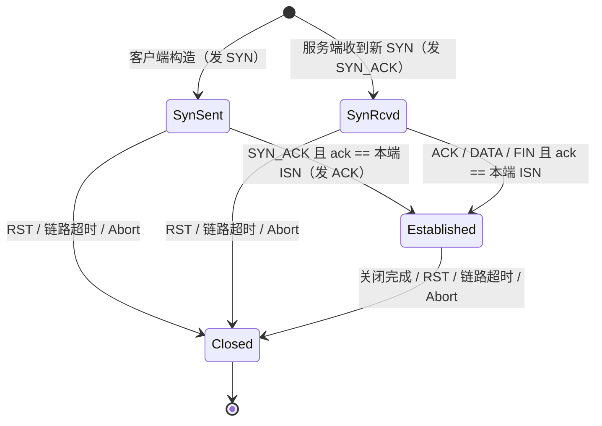
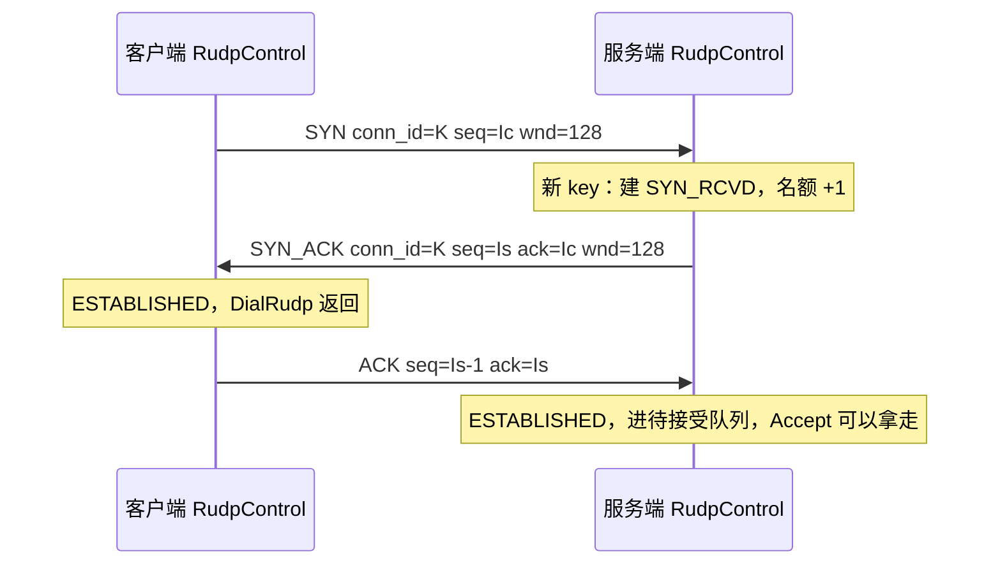
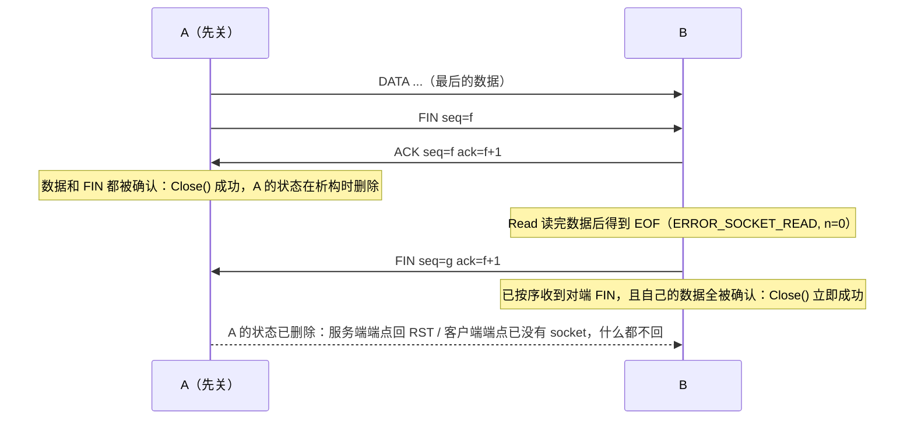
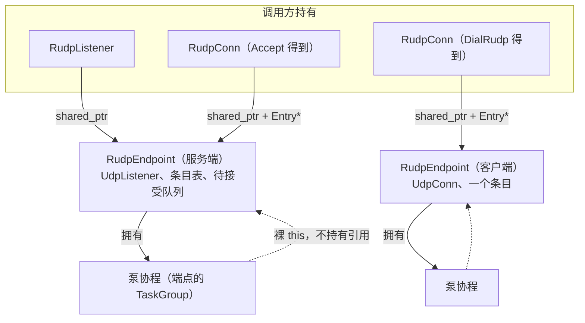

# RUDP：UDP 上的最小可靠字节流

状态：**已实现**（`src/coco/net/rudp/`，测试在 `tests/rudp_test.cpp`）。行为摘要在 [架构](architecture.md) 的“协议”一节；这里保留设计理由、线上格式、算法和测试清单。实现过程中对设计的修正集中记在第 21 节。

这份文档写给要实现、审查或使用 RUDP 的人。先讲边界和接口，再讲线上格式和协议算法（纯状态机，不碰协程），然后讲会话层怎样把状态机接到协程和 UDP socket 上，最后是按 [编码与审查](../development.md) 要求列出的风险、行为记录和测试计划。

## 1. 目标与边界

### 1.1 要做的

在一个 UDP socket 上提供**有序、可靠、带流量控制的字节流**，对外就是一条 `StreamConn`：

- 客户端 `DialRudp(host, port, timeout_us, &conn)`，服务端 `ListenRudp(ip, port, &listener)` 后 `Accept`。
- `RudpListener` 是 `StreamListener`，可以直接交给 `TcpServer::Serve`；`RudpDialer()` 是 `StreamDialer`，可以交给 `HttpClient::SetDialer`、`RtmpClient::SetDialer`，也可以作为 `TlsDialer(cfg, RudpDialer())` 的下层。
- 所以 HTTP、WebSocket、RTMP、TLS 都可以不改一行代码跑在 RUDP 上，这也是验收标准之一。

“最小”的意思是：每个机制只保留让字节流**正确**所必需的部分，性能和公网适应性的机制一律不做，并在 1.3 里写明代价。

### 1.2 为什么是字节流，而不是可靠报文

coco 的网络代码按“它是不是在帮你拿到一条 `StreamConn`”来划分（见 [架构](architecture.md)）。做成字节流，RUDP 就和 TCP、TLS 处在同一个位置，上面所有协议直接复用，测试也可以复用 HTTP / TLS 现成的断言。可靠报文（每次 `Read` 拿到一整条消息）要另起一套接口，上层协议都用不上，留到以后真有需求再做（见 第 20 节）。

### 1.3 不做的，以及代价

| 不做 | 代价 / 风险 | 以后怎么加 |
| --- | --- | --- |
| 完整的拥塞控制 | 只有最简的 AIMD（8.7）：慢启动、拥塞避免、丢包时窗口减半、超时降到 1。没有 pacing（一个窗口的段一次发出）、ECN、空闲后重置窗口、按带宽或延迟的算法（BBR、CUBIC），和 TCP 竞争时不保证公平。 | 换 `RudpControl` 里的 `OnAck` / `OnLoss` |
| 路径 MTU 探测 | 固定 MSS 1200 字节，数据报最大 1216 字节，低于 IPv6 最小 MTU 1280 减去 IP/UDP 头。更大的 MTU 用不上。 | SYN 里协商 MSS |
| SACK 块 | 每个数据段单独确认（第 8.3 节），够用；但 ACK 丢了就要等后面的 ACK 或累计确认补上。 | ACK 里带位图 |
| 延迟 ACK、Nagle | 每个数据段回一个 ACK，每次 `Write` 立即发出能发的段。小写多时包数多。 | 在 `Flush` 里攒 |
| 保活（keepalive） | 双方都不发数据时，对端消失察觉不到，和不开 keepalive 的 TCP 一样。用 `SetRecvTimeout` 兜底。 | 空闲时定期发 ACK 探测 |
| 半关闭（只关写方向） | `StreamConn` 本来就没有 `CloseWrite`，TCP 那边也没做。 | 给 `RudpConn` 加 `CloseWrite()` |
| 连接迁移（NAT 重绑定后换地址） | 服务端按（对端地址, conn_id）找连接，地址变了就是另一条连接，旧连接最终链路超时。 | 只按 conn_id 找，再校验 |
| 加密、认证 | 路径上的攻击者可以伪造、注入、重置。要机密性和完整性，套 TLS（`TlsDialer(cfg, RudpDialer())`），TLS 能发现注入，但挡不住 RST。 | DTLS 或 QUIC 式的握手 |
| 跨线程 | 端点、连接、监听都属于创建它们的线程。没有 `Release()`，`TcpServerOptions::threads > 1` 时 `TcpServer` 拒绝 `RudpListener`（已有逻辑：只接受 `TcpListener`，返回 `ERROR_SYSTEM_CONFIG_INVALID`）。 | 每个 worker 一个端点 + `SO_REUSEPORT` |
| 空闲时不唤醒 | 端点上只要还有连接，泵协程就每 `interval_us`（默认 10ms）醒一次，空闲连接也一样（第 11.4 节）。 | 按最近的定时器算超时，写入方唤醒泵 |
| 防反射放大 | 一个伪造源地址的 SYN 最多引出约 8 个 SYN_ACK（第 13.3 节）。半开连接数受 `backlog` 限制。**不要直接暴露在公网上。** | SYN cookie |

和 [协议规划](protocols.md) 里“SRT、QUIC 暂不做”的判断不冲突：那两者要的是成熟的拥塞控制、低延迟推流和 HTTP/3；这里只是一条能替代 TCP 的最小传输，主要价值是验证 `StreamConn` 抽象确实能换掉下层传输，也给以后的 SRT / QUIC 留一套能复用的测试设施（丢包中继、假时钟）。

## 2. 放在哪一层

### 2.1 目录和文件

RUDP 是“帮你拿到一条字节流”的东西，放 `net/`，和 `net/dns/` 一样是一个协议目录，内部按 codec / 会话分层：

```text
src/coco/net/rudp/
├── codec/
│   ├── packet.hpp  packet.cpp     报文头的编码和解码、常量（版本、头长、MSS、类型）
│   └── control.hpp control.cpp    RudpOptions、RudpStats、RudpControl：一条连接的完整协议状态机，
│                                  输入报文和当前时间，输出要发的报文；不碰 socket、协程和时钟
├── endpoint.hpp    endpoint.cpp   内部：RudpEndpoint，一个 UDP socket、一条泵协程、按 key 找连接
└── conn.hpp        conn.cpp       RudpConn、RudpListener、DialRudp、ListenRudp、RudpDialer
```

文件名只说角色，不重复目录名。**不能叫 `server.*`**：`check_layers.cmake` 会把任何 `server.*` 当成 server 层。

### 2.2 分层检查

| 文件 | 层（`check_layers.cmake` 判定） | 可以 include |
| --- | --- | --- |
| `net/rudp/codec/*` | codec（rank 1），协议 `rudp` | `common/`、`log/`、`utils/`；**不能** include `base/`、`coco_api.h`、`st.h` |
| `net/rudp/endpoint.*`、`net/rudp/conn.*` | net（rank 2），协议 `rudp` | `net/conn.hpp`、`net/udp.hpp`、`net/socket.hpp`（都在 `net/` 根下，不属于任何协议）、`base/task_group.hpp`、本目录的 codec |

不需要在 `COCO_PROTO_ALLOWED` 里加任何一项：RUDP 只用 `net/` 根下的 UDP，主机名解析由 `DialUdp` → `DialDatagram` → `DefaultResolver()` 完成，RUDP 自己不 include `net/dns/`。`tls` 比 `net` 高一层，可以套在 RUDP 上面；RUDP 不能 include `tls`，也不需要。

### 2.3 和现有代码的接缝

- `coco/coco.h` 加 `#include "coco/net/rudp/conn.hpp"`。
- `endpoint.hpp` 是库内部头文件，加进 `src/CMakeLists.txt` 安装时排除的列表（和 `utils/utils.hpp`、`base/shutdown.hpp` 一样）。
- 错误码加在 `common/error.hpp` 的 4081–4083（第 12.3 节）。`coco_is_client_gracefully_close` 加上 `ERROR_RUDP_RESET`：对端 RST 相当于 TCP 的 `ECONNRESET`，后者在 TCP 路径上表现为 `ERROR_SOCKET_READ`，本来就算“对端正常走了”，日志级别保持一致。
- `TcpServer` 的连接协程在 `DoCycle()` 末尾释放 `StreamConn`（原来在 `delete handler` 时）。原因见第 21 节：那之后析构的对象看到的 `CocoShouldStop()` 总是 false，`Stop()` 会被 RUDP 的关闭握手拖住。
- 比较两个 `sockaddr_storage` 的函数 `SameEndpoint` 现在是 `net/dns/resolver.cpp` 里的匿名函数。RUDP 在 `endpoint.cpp` 里放一份同样语义的（族、端口、地址，IPv6 再比 scope ID，不比 flowinfo），不去改 DNS。以后有第三个用户时再挪到 `net/conn.hpp`，和 `FormatSockaddr` 放在一起。

## 3. 对外接口

### 3.1 头文件草案

```cpp
// coco/net/rudp/codec/control.hpp
namespace coco {

// Fixed when a connection or listener is created; a connection keeps a copy.
struct RudpOptions {
    // How often the endpoint runs retransmission and liveness timers.
    int64_t interval_us = 10 * 1000;
    // Retransmission timeout before the first RTT sample, and its bounds.
    int64_t initial_rto_us = 200 * 1000;
    int64_t min_rto_us = 100 * 1000;
    int64_t max_rto_us = 2 * 1000 * 1000;
    // The link is dead when something we sent stays unacknowledged and nothing at all is
    // heard from the peer for this long. Also bounds Close() and a Dial with kNoTimeout.
    int64_t link_timeout_us = 10 * 1000 * 1000;
    // Segments (of up to kRudpMss bytes) in flight, and buffered on the receive side.
    // Clamped to [1, 1024].
    int send_window = 128;
    int recv_window = 128;
    // Listener only: half-open connections plus established ones not accepted yet.
    int backlog = 128;
};

struct RudpStats {
    uint64_t segments_sent = 0;       // first transmissions of DATA and FIN
    uint64_t rto_resends = 0;         // retransmissions on timeout
    uint64_t fast_resends = 0;        // retransmissions after kRudpFastResend later ACKs
    uint64_t segments_received = 0;   // DATA and FIN accepted into the receive buffer
    uint64_t duplicates = 0;          // DATA and FIN received again
    uint64_t congestion_events = 0;   // rounds of loss that cut the congestion window
    int64_t srtt_us = 0;              // 0 until the first sample
    int64_t rto_us = 0;
    int cwnd = 0;                     // congestion window, in segments
    int ssthresh = 0;
    int in_flight = 0;                // segments sent and not yet acknowledged in order
};

}  // namespace coco
```

```cpp
// coco/net/rudp/conn.hpp
namespace coco {

// A reliable, ordered byte stream over UDP; see .harness/docs/rudp.md. It belongs to
// the thread that created it. One coroutine may read while others write; bytes of
// concurrent writers may interleave, as on a TcpConn.
//
// End of stream follows the StreamConn convention: once the peer's FIN has been read past,
// Read returns ERROR_SOCKET_READ with *nread == 0, as TcpConn does.
class RudpConn : public StreamConn {
 public:
    // Close(), unless it has been called. May yield, bounded by link_timeout_us; does not
    // wait when the coroutine has been stopped (CocoShouldStop()). No coroutine may be
    // blocked in Read or Write on this connection.
    ~RudpConn() override;

    int Read(void *buf, size_t size, ssize_t *nread) override;
    // Returns once every byte is in the send buffer, not when it was acknowledged.
    int Write(void *buf, size_t size, ssize_t *nwrite) override;
    int Writev(const iovec *iov, int iov_size, ssize_t *nwrite) override;
    std::string LocalAddr() override;
    std::string RemoteAddr() override;
    // Bound one Read waiting for data, one Write waiting for buffer space.
    void SetRecvTimeout(int64_t timeout_us) override;
    void SetSendTimeout(int64_t timeout_us) override;

    // Sends FIN after what was written and waits until the peer has acknowledged every
    // byte (section 10). COCO_SUCCESS means all of it reached the peer's receive buffer;
    // an error means it may or may not have. Later calls return the same result; Read
    // and Write then fail with ERROR_RUDP_CLOSED.
    int Close();

    RudpStats Stats() const;
};

// Accepts RUDP connections on one UDP socket. Accept does not do the handshake, the
// endpoint does, so a silent peer holds up nothing. Destroying the listener refuses new
// connections (RST) and drops those not accepted yet; accepted ones keep working, and
// the UDP port stays bound until the last of them is destroyed.
class RudpListener : public StreamListener {
 public:
    // No coroutine may be blocked in Accept.
    ~RudpListener() override;
    int Accept(std::unique_ptr<StreamConn> *conn) override;
    int AcceptRudp(std::unique_ptr<RudpConn> *conn);
    std::string Addr() override;
};

// ip must be an IP literal, as for ListenUdp.
int ListenRudp(const std::string &ip, int port, std::unique_ptr<RudpListener> *l,
               const RudpOptions &options = RudpOptions());
// Resolves host with DefaultResolver() and uses the first address. timeout_us bounds the
// handshake, not the name lookup; kNoTimeout means link_timeout_us.
int DialRudp(const std::string &host, int port, int64_t timeout_us,
             std::unique_ptr<RudpConn> *conn, const RudpOptions &options = RudpOptions());
// DialRudp as a StreamDialer, for HttpClient::SetDialer, TlsDialer(cfg, RudpDialer()) ...
StreamDialer RudpDialer(RudpOptions options = RudpOptions());

}  // namespace coco
```

### 3.2 用法

回显服务，处理函数和 TCP 版一字不差：

```cpp
std::unique_ptr<RudpListener> l;
if (ListenRudp("127.0.0.1", 9000, &l) != COCO_SUCCESS) return 1;
TcpServer server([](StreamConn &conn) {
    char buf[4096];
    ssize_t n = 0;
    int ret;
    while ((ret = conn.Read(buf, sizeof(buf), &n)) == COCO_SUCCESS) {
        if ((ret = conn.Write(buf, n, nullptr)) != COCO_SUCCESS) break;
    }
    return ret;
});
return server.Serve(std::move(l));   // 到 Ctrl-C 为止
```

客户端：

```cpp
std::unique_ptr<RudpConn> conn;
if (DialRudp("127.0.0.1", 9000, 1000 * 1000, &conn) != COCO_SUCCESS) return 1;
conn->Write((void *)"hello", 5, nullptr);
char buf[16];
ssize_t n = 0;
conn->Read(buf, sizeof(buf), &n);
return conn->Close();   // 确认对端都收到了
```

HTTP 和 TLS 叠在上面：

```cpp
// 服务端：HTTP over RUDP
HttpServeMux mux;
// ... mux.HandleFunc(...)
TcpServer server([&mux](StreamConn &c) { return ServeHttpConn(c, &mux); });
server.Serve(std::move(rudp_listener));

// 客户端：HTTP over RUDP，以及 HTTPS over RUDP
HttpClient client;
client.SetDialer(RudpDialer());
client.SetTlsDialer(TlsDialer(nullptr, RudpDialer()));
```

## 4. 线上格式

### 4.1 报文头

每个 UDP 数据报正好一个 RUDP 报文：16 字节固定头，DATA 后面跟负载。多字节字段都是网络字节序（大端）。负载长度不单独编码，等于数据报长度减 16：UDP 本身保留报文边界，少一个字段就少一种“长度和实际不符”的输入。

```text
 0                   1                   2                   3
 0 1 2 3 4 5 6 7 8 9 0 1 2 3 4 5 6 7 8 9 0 1 2 3 4 5 6 7 8 9 0 1
+---------------+---------------+-------------------------------+
|  version = 1  |     type      |            window             |
+---------------+---------------+-------------------------------+
|                            conn_id                            |
+---------------------------------------------------------------+
|                              seq                              |
+---------------------------------------------------------------+
|                              ack                              |
+---------------------------------------------------------------+
|                  payload（只有 DATA 有，1..1200 字节）          |
+---------------------------------------------------------------+
```

| 字段 | 宽度 | 含义 |
| --- | --- | --- |
| `version` | 8 | 固定 1。别的值整包丢弃，留给以后不兼容的改动。 |
| `type` | 8 | 见 4.2。 |
| `window` | 16 | 发送方此刻的接收窗口剩余，单位是段（不是字节），见 8.5。 |
| `conn_id` | 32 | 客户端随机选的非零值，整条连接不变。服务端用（对端地址, `conn_id`）找连接；它也让旧连接的迟到报文和新连接区分开。 |
| `seq` | 32 | 含义随类型变，见 4.3。 |
| `ack` | 32 | 发送方的 `rcv_nxt`：对端那个方向上，序号小于它的段都已按序收到（累计确认）。 |

常量（`codec/packet.hpp`）：

| 名字 | 值 | 说明 |
| --- | --- | --- |
| `kRudpVersion` | 1 | |
| `kRudpHeaderSize` | 16 | |
| `kRudpMss` | 1200 | 一个 DATA 的最大负载。16 + 1200 + UDP 8 + IPv6 40 = 1264 < 1280。 |
| `kRudpMaxDatagram` | 1216 | 接收缓冲区开 1217 字节：收到 1217 说明被截断或超长，丢弃。 |
| `kRudpFastResend` | 3 | 快速重传门限，见 8.4。 |
| `kRudpMaxWindow` | 1024 | 窗口选项的上限，限制每个 ACK 的处理量，见 13.2。 |

### 4.2 报文类型

| 值 | 名字 | 方向 | 作用 |
| --- | --- | --- | --- |
| 1 | `SYN` | 客户端 → 服务端 | 发起连接，带客户端 ISN 和窗口 |
| 2 | `SYN_ACK` | 服务端 → 客户端 | 接受连接，带服务端 ISN、回显客户端 ISN |
| 3 | `ACK` | 双向 | 确认一个段（选择确认）加累计确认；也用作握手的第三个包和窗口更新 |
| 4 | `DATA` | 双向 | 一段字节，占一个序号 |
| 5 | `FIN` | 双向 | 本端不再发送，占一个序号，排在所有数据之后 |
| 6 | `RST` | 双向 | 这条连接在本端不存在或已经中止 |

### 4.3 各类型的字段

| 类型 | `seq` | `ack` | `window` | 负载 |
| --- | --- | --- | --- | --- |
| `SYN` | 客户端 ISN | 0（忽略） | 客户端接收窗口 | 无 |
| `SYN_ACK` | 服务端 ISN | 客户端 ISN（回显，客户端据此确认这是对自己这次 SYN 的回答） | 服务端接收窗口 | 无 |
| `ACK` | 被确认的那个对端段的序号；纯累计确认时为 `rcv_nxt - 1` | 本端 `rcv_nxt` | 本端接收窗口 | 无 |
| `DATA` | 本段序号 | 本端 `rcv_nxt`（捎带累计确认） | 本端接收窗口 | 1..1200 字节 |
| `FIN` | 本段序号 | 本端 `rcv_nxt` | 本端接收窗口 | 无 |
| `RST` | 0（忽略） | 0（忽略） | 0（忽略） | 无 |

`ACK.seq` 的约定是“**发送方确实持有的一个段的序号，或者 `rcv_nxt - 1`**”。`rcv_nxt - 1` 之前的段都已按序收到，所以这句话总是真的；对发送方来说这个序号已经低于 `snd_una`，按 8.3 的规则是空操作。于是“确认某一段”和“只报告累计确认和窗口”可以用同一种报文，不需要标志位。握手第三个包、窗口更新、对窗口外数据的回应都是纯累计确认。还没收到对端任何数据时，`rcv_nxt` 等于对端 ISN，`seq` 就是 ISN − 1（按 32 位回绕）。

### 4.4 解码校验（`DecodeRudpPacket`）

解码只看报文本身，任何一条不满足就整包丢弃，不回应、不改任何连接状态：

1. 长度 ≥ 16 且 ≤ 1216。
2. `version == 1`。
3. `type` 在 1..6。
4. `conn_id != 0`。
5. `DATA` 的负载长度在 1..1200；其他类型负载长度必须是 0。

和连接状态有关的校验（序号是否在窗口里、`ack` 是否越界、SYN_ACK 回显的 ISN 对不对）放在 `RudpControl::Input`，见第 8 节。

## 5. 序号、ISN 与窗口

### 5.1 序号按段计

序号按段计，不按字节计（和 KCP 的 `sn` 一样，和 TCP 不同）：每个 DATA 和 FIN 占一个序号，SYN / SYN_ACK / ACK / RST 不占。好处是接收缓冲区可以直接用“相对 `rcv_nxt` 的段偏移”做下标，选择确认也只需要一个序号。

### 5.2 回绕比较

序号是 `uint32_t`，比较一律用 RFC 1982 的序列号算术：`Before(a, b) := (int32_t)(a - b) < 0`。窗口最大 1024 段，远小于 2³¹，任何时刻在用的序号都在一个半圈之内，比较不会有歧义。实现里不允许出现直接的 `a < b`，`std::map<uint32_t, ...>` 这种按无符号大小排序的容器也不能用来存序号（回绕后顺序错），接收缓冲区用环形数组（8.5）。

### 5.3 ISN

每个方向的初始序号（ISN）随机选（`thread_local std::random_device`，和 DNS、WebSocket 的做法一样），在 SYN / SYN_ACK 的 `seq` 里告诉对方。随机 ISN 有两个作用：旧连接的迟到报文即使碰上同一个 `conn_id`，序号也大概率落在窗口外；也让测试自然覆盖回绕（测试里把 ISN 固定在 `0xFFFFFF00` 附近）。`conn_id` 加双向 ISN，盲注入要同时猜中 32 位 `conn_id` 和窗口内的序号；这不是安全机制（1.3）。

## 6. 连接状态机

`RudpControl` 只有四个状态，关闭过程用 ESTABLISHED 里的两个标志表达，不再细分 TCP 的 FIN_WAIT_1/2、CLOSING、TIME_WAIT 等状态，原因见第 10 节。



ESTABLISHED 里的标志：

| 标志 | 含义 |
| --- | --- |
| `close_requested_` | 本端调用过 `Close()`，FIN 已排进发送队列（排在所有数据之后） |
| `peer_fin_` | 对端的 FIN 已经**按序**收到：它之前的数据都到了，`rcv_nxt` 越过了它 |

CLOSED 记一个原因 `result_`：

| `result_` | 来源 | 读写返回 |
| --- | --- | --- |
| `COCO_SUCCESS` | 关闭完成（10.2） | `ERROR_RUDP_CLOSED` |
| `ERROR_RUDP_RESET` | 收到 RST，且本端还有未确认的数据 | `ERROR_RUDP_RESET` |
| `ERROR_RUDP_TIMEOUT` | 链路超时（第 9 节） | `ERROR_RUDP_TIMEOUT` |
| `ERROR_RUDP_CLOSED` | 本端 `Abort()` | `ERROR_RUDP_CLOSED` |

完整的转移表：

| 状态 | 事件 | 动作 | 新状态 |
| --- | --- | --- | --- |
| SYN_SENT | 构造 | 选 ISN，输出 SYN，启动握手重传定时器 | SYN_SENT |
| SYN_SENT | 握手 RTO 到期 | 重发 SYN，RTO 翻倍（封顶 `max_rto_us`） | SYN_SENT |
| SYN_SENT | `SYN_ACK`，`ack == 本端 ISN` | 记下对端 ISN（`rcv_nxt = 对端 ISN`）和窗口；SYN 只发过一次时取 RTT 样本；输出纯 ACK | ESTABLISHED |
| SYN_SENT | `SYN_ACK`，`ack` 不对 | 丢弃 | SYN_SENT |
| SYN_SENT | `RST` | `result_ = RESET` | CLOSED |
| SYN_SENT | 其他类型 | 丢弃 | SYN_SENT |
| SYN_RCVD | 构造（收到 SYN） | 记下对端 ISN 和窗口；选 ISN，输出 SYN_ACK，启动握手重传定时器 | SYN_RCVD |
| SYN_RCVD | 握手 RTO 到期 | 重发 SYN_ACK，RTO 翻倍 | SYN_RCVD |
| SYN_RCVD | `SYN`，ISN 与记下的相同 | 重发 SYN_ACK（客户端没收到） | SYN_RCVD |
| SYN_RCVD | `ACK` / `DATA` / `FIN`，`ack == 本端 ISN` | SYN_ACK 只发过一次时取 RTT 样本；然后**按 ESTABLISHED 处理这个包** | ESTABLISHED |
| SYN_RCVD | `RST` | `result_ = RESET` | CLOSED |
| SYN_SENT / SYN_RCVD | 链路超时 | `result_ = TIMEOUT`；客户端发 RST（服务端可能还占着半开名额），服务端半开连接不发 RST，静默丢弃 | CLOSED |
| ESTABLISHED | `DATA` / `FIN` / `ACK` | 第 8 节的数据路径；可能触发关闭完成 | ESTABLISHED 或 CLOSED |
| ESTABLISHED | 重复的 `SYN_ACK`（客户端） | 输出纯 ACK：服务端没收到第三个包 | ESTABLISHED |
| ESTABLISHED | 重复的 `SYN`（服务端，ISN 相同） | 重发 SYN_ACK | ESTABLISHED |
| ESTABLISHED | `RST` | 已 `Close()` 且数据全确认 → 关闭完成（`result_ = SUCCESS`）；否则 `result_ = RESET` | CLOSED |
| ESTABLISHED | `Close()` | FIN 入发送队列；`Flush` | ESTABLISHED |
| ESTABLISHED | 链路超时 | 输出 RST，`result_ = TIMEOUT` | CLOSED |
| 任何非 CLOSED | `Abort()` | 输出 RST，`result_ = CLOSED` | CLOSED |
| CLOSED | 任何非 RST 的包 | 输出 RST | CLOSED |
| SYN_RCVD / ESTABLISHED | `ACK` / `DATA` / `FIN` 的 `ack` 超过 `snd_nxt` | 整包丢弃（见 8.3） | 不变 |

两条全局规则：

- **永远不回应 RST**。否则两端各自没有状态时会互相 RST 到天荒地老。
- RST 和触发它的包一样长（16 字节），不放大。

## 7. 握手

三次握手。服务端在 SYN_RCVD 里不把连接交给 `Accept`，等客户端证明自己收到了 SYN_ACK（回来的包里 `ack == 服务端 ISN`），才把它放进待接受队列。这样伪造源地址的 SYN 不会变成应用层看得见的连接，只占一个半开名额，并在链路超时后被清掉。

### 7.1 正常



### 7.2 丢包时

| 丢的包 | 谁发现 | 怎么恢复 |
| --- | --- | --- |
| SYN | 客户端握手 RTO | 重发 SYN（第一次 `initial_rto_us`，之后翻倍） |
| SYN_ACK | 两边都可能：客户端握手 RTO 重发 SYN，服务端握手 RTO 重发 SYN_ACK | 服务端收到重复 SYN（ISN 相同）就再回 SYN_ACK；不会建第二条连接 |
| 第三个包（ACK） | 服务端握手 RTO | 重发 SYN_ACK；客户端在 ESTABLISHED 收到重复 SYN_ACK 就再回纯 ACK。客户端如果先发了 DATA，DATA 的 `ack` 字段同样完成确认，服务端直接进入 ESTABLISHED 并收下这个 DATA |
| 一直收不到回答 | 客户端 | `DialRudp` 的截止时间到：发一个 RST（尽力而为，让服务端早点释放半开名额），返回 `ERROR_RUDP_TIMEOUT` |

服务端需要自己的 SYN_ACK 重传定时器，是为了“服务端先说话”的协议（客户端连上后只读，例如 SMTP 风格）：第三个包丢了而客户端不发数据时，只有服务端重传能把握手补完。

### 7.3 服务端名额

`backlog` 限制“SYN_RCVD + 已建立但还没被 `Accept`”的连接总数。满了以后，新 key 的 SYN 静默丢弃（不回 RST），客户端会重传，等名额空出来再进来，和 TCP 的 SYN 队列满一样。`Accept` 取走一条，名额减一；半开连接链路超时被清掉，名额也减一。

### 7.4 拒绝

- 监听已销毁（`accepting_ == false`）：新 key 的 SYN 回 RST，客户端 `DialRudp` 返回 `ERROR_RUDP_RESET`，相当于 TCP 的 connection refused。
- 端口上根本没有 RUDP（没有进程监听）：UDP 没有可靠的拒绝信号（ICMP 端口不可达没走 ST，也不可靠），客户端只能等到截止时间，返回 `ERROR_RUDP_TIMEOUT`。

## 8. 数据传输

### 8.1 发送端的数据结构

```cpp
struct Segment {
    uint32_t seq = 0;
    bool fin = false;
    std::string data;          // DATA: 1..kRudpMss bytes; FIN: empty
    int xmit = 0;              // transmissions so far
    int64_t first_sent_us = 0; // first transmission
    int64_t sent_us = 0;       // latest transmission
    int64_t rto_us = 0;        // this segment's timeout, doubled on each RTO resend
    int64_t resend_us = 0;     // sent_us + rto_us
    int skipped = 0;           // ACKs for later segments since the latest transmission
    bool fast_resent = false;  // fast retransmission is used at most once per segment
    bool acked = false;        // selectively acknowledged, waiting for snd_una to pass it
};

std::deque<Segment> snd_queue_;  // written but not sent: no sequence number yet
std::deque<Segment> snd_buf_;    // sent, from snd_una_ up to snd_nxt_, ordered by seq
uint32_t snd_una_;               // oldest unacknowledged sequence number
uint32_t snd_nxt_;               // next sequence number to assign
uint16_t rmt_wnd_;               // window the peer advertised last
```

不变量：`snd_buf_` 恰好覆盖 `[snd_una_, snd_nxt_)`，每个序号一项，按序号递增；`snd_buf_.front()` 没被选择确认（被确认了就该随 `snd_una_` 前移出队）。

### 8.2 写入与发送（`Send` / `Flush`）

`Send(data, n)` 把字节拷进 `snd_queue_`，返回实际接受的字节数：

1. 先补满队尾那个还没发出、不是 FIN、不足 MSS 的段。只合并**还没发出**的段：已发出的段内容不能再变，否则重传的字节和第一次不一样。
2. 再按 MSS 切新段，直到 `snd_queue_.size() == send_window`。
3. 返回接受的字节数，可能小于 `n`（队列满）。`close_requested_` 或 CLOSED 时返回 0，由会话层报错。

`Flush(now)` 把队列里的段编号发出，直到窗口用完：

```text
limit = min(send_window, rmt_wnd_, cwnd_)         // cwnd_ 见 8.7，总是 >= 1
if limit == 0 && snd_buf_ 为空: limit = 1          // 零窗口探测，见 8.6
while snd_queue_ 非空 && snd_buf_.size() < limit:
    seg = snd_queue_.pop_front()
    seg.seq = snd_nxt_++
    Transmit(seg, now)                              // 第一次发送
    snd_buf_.push_back(seg)
```

`Transmit(seg, now)`：

```text
seg.xmit++
if seg.xmit == 1: seg.first_sent_us = now; seg.rto_us = rto_
seg.sent_us = now
seg.resend_us = now + seg.rto_us
seg.skipped = 0
输出 DATA 或 FIN：seq = seg.seq，ack = rcv_nxt_，window = 本端接收窗口
```

`snd_buf_.size()` 就是 `snd_nxt_ − snd_una_`。对端窗口是相对它的 `rcv_nxt` 说的，而对端的 `rcv_nxt` 就是本端处理完这个 ACK 之后的 `snd_una_`，所以“在途段数 < 对端窗口”正好对应“对端放得下”。被选择确认、还在等 `snd_una_` 越过的段也计入在途：它们在对端的乱序缓冲区里，确实占着对端的槽位。

### 8.3 收到确认（ACK，以及 DATA / FIN 上捎带的 `ack`）

```text
if Before(snd_nxt_, p.ack):          // 确认了没发过的序号：伪造或损坏
    整包丢弃，return

// 1. 选择确认（只对 type == ACK）。必须在累计确认之前：按序到达时累计确认也覆盖这个段，
//    先弹出它就再也取不到 RTT 样本了。
if !Before(p.seq, snd_una_) && Before(p.seq, snd_nxt_):
    seg = snd_buf_[p.seq - snd_una_]
    if !seg.acked:
        seg.acked = true
        if seg.xmit == 1: UpdateRtt(now - seg.sent_us)        // Karn：重传过的不取样
        // 3. 快速重传
        for s in snd_buf_ 中 seq 在 p.seq 之前、!s.acked、!s.fast_resent 的段:
            if ++s.skipped >= kRudpFastResend:
                s.fast_resent = true
                OnLoss(s, timeout = false)                        // 8.7
                FastResend(s, now)        // 和 Transmit 相同，但不翻倍 rto_us

// 2. 累计确认
if !Before(p.ack, snd_una_):         // p.ack >= snd_una_：不是过时的
    rmt_wnd_ = p.window
    while snd_buf_ 非空 && Before(snd_buf_.front().seq, p.ack):
        snd_buf_.pop_front()
    snd_una_ = p.ack
// 过时的 ack（乱序到达的旧包）：不动 snd_una_ 和 rmt_wnd_，旧窗口值会让发送端误判
while snd_buf_ 非空 && snd_buf_.front().acked:                  // 选择确认补上了空洞
    snd_buf_.pop_front(); snd_una_++

// 3. 拥塞窗口按新确认的段数增长（第 1 步新标记的，加上第 2 步弹出的、之前没被选择确认过的）
OnAcked(新确认的段数)                                            // 8.7

// 4. 窗口可能打开了
Flush(now)
```

快速重传每段最多一次，之后只靠 RTO。这样一次突发丢包不会因为后面陆续到达的 ACK 引出一串重复的快速重传。

`snd_una_` 前移时，如果本端在 `Close()` 之后，检查关闭是否完成（10.2）。

### 8.4 RTO

按 RFC 6298 估计，单位微秒：

```text
UpdateRtt(r):
    if srtt_ == 0:  srtt_ = r; rttvar_ = r / 2
    else:           rttvar_ = (3 * rttvar_ + |srtt_ - r|) / 4
                    srtt_   = (7 * srtt_ + r) / 8
    rto_ = clamp(srtt_ + max(interval_us, 4 * rttvar_), min_rto_us, max_rto_us)
```

- 第一次取样之前 `rto_ = initial_rto_us`。
- 取样只用第一次发送就被确认的段（Karn 算法），握手也一样：SYN / SYN_ACK 只发过一次才取样。
- 退避是**每段各自的**：段因 RTO 重传时 `seg.rto_us = min(seg.rto_us * 2, max_rto_us)`，`rto_` 本身不翻倍。新段用当前的 `rto_`。
- `max(interval_us, …)`：定时器每 `interval_us` 才检查一次，RTO 小于一个 tick 没有意义。

`Update(now)`，由泵每个 tick 调用：

```text
if CLOSED: return
if SYN_SENT / SYN_RCVD 且 now >= hs_resend_us_: 重发 SYN / SYN_ACK，hs_rto_us_ 翻倍
for seg in snd_buf_ 中 !seg.acked 且 now >= seg.resend_us 的段:
    OnLoss(seg, timeout = true)                              // 8.7
    seg.rto_us = min(seg.rto_us * 2, max_rto_us)
    Transmit(seg, now)                                       // rto_resends++
检查链路超时（第 9 节）
Flush(now)
```

### 8.5 接收端

```cpp
struct Slot {
    bool used = false;
    uint32_t seq = 0;
    bool fin = false;
    std::string data;
};
std::vector<Slot> rcv_ring_;        // recv_window rounded up to a power of two; seq % size
std::deque<std::string> rcv_queue_; // in order, not read yet; the front may be partly read
size_t rcv_front_off_ = 0;          // bytes of rcv_queue_.front() already read
uint32_t rcv_nxt_;
uint16_t last_adv_wnd_;             // window in the latest packet we sent
```

本端通告的窗口 `AdvWindow() = recv_window − rcv_queue_.size()`：还没被应用读走的按序段占槽位（读了一部分的也算一个），乱序段放在环里，允许的偏移随之缩小。总内存因此不超过 `recv_window × MSS`。

收到 DATA / FIN（ESTABLISHED 下，`ack` 已按 8.3 处理）：

```text
off = p.seq - rcv_nxt_                                // uint32 减法
if Before(p.seq, rcv_nxt_):                           // 已经按序收过
    duplicates++; 输出 ACK(seq = p.seq)；return
if fin_seq_ 已知:
    if Before(fin_seq_, p.seq):                       丢弃（FIN 之后不该有段）；return
    if p.seq == fin_seq_ && p 是 DATA:                 丢弃（占了 FIN 的序号）；return
    if p 是 FIN && p.seq != fin_seq_:                  丢弃（第二个不同序号的 FIN）；return
if off >= AdvWindow() && !(p 是 FIN && off == 0):      // 窗口外，或者放不下；FIN 不占地方
    输出纯 ACK(seq = rcv_nxt_ - 1)；return            // 让发送端知道当前窗口
slot = rcv_ring_[p.seq % size]
if slot.used:
    if slot.seq != p.seq: return                      // 不确认没持有的段
    duplicates++                                      // 乱序段又来了一次
else: slot = {used, p.seq, fin, payload}; segments_received++; if fin: fin_seq_ = p.seq
while !peer_fin_ && rcv_ring_[rcv_nxt_ % size].used 且 .seq == rcv_nxt_:
    取出；FIN → peer_fin_ = true（流到此为止）；DATA → rcv_queue_.push_back(data)
    rcv_nxt_++
输出 ACK(seq = p.seq)
```

环的大小是 `recv_window` 向上取到 2 的幂：2 的幂整除 2³²，`seq % size` 在回绕前后也是一个序号一个槽；加上 `off < AdvWindow() ≤ recv_window ≤ size`，同一时刻环里不会有两个序号落在同一个槽。用 `recv_window` 本身做模数时，非 2 的幂的窗口会让回绕两侧相邻的序号撞槽（`recv_window = 3` 时 `0xffffffff % 3 == 0 % 3`），重传的段被当成重复并被错误地确认，流永远卡住；`RudpControlRingNotPowerOfTwo` 覆盖这一点。

按序搬运在 FIN 处停下：FIN 之后哪怕环里已经有段（只可能来自伪造或出错的对端），也不会交给读者。

窗口为 0 时仍收下下一个序号上的 FIN：它不占缓冲区，收下以后对端的关闭就能完成，本端应用读完缓冲里的数据就看到 EOF。

`Recv(buf, size)` 从 `rcv_queue_` 拷出最多 `size` 字节，返回拷出的数量（可能是 0）。拷完以后如果 `last_adv_wnd_ == 0` 而 `AdvWindow() > 0`，输出一个纯 ACK 作为窗口更新。

### 8.6 零窗口

接收方应用不读，窗口降到 0。发送方的 `Flush` 在 `rmt_wnd_ == 0` 且没有在途段时仍然放行一个段（8.2 的 `limit = 1`）。这个段就是探测：

- 对端还没空间：按 8.5 不收，回纯 ACK（窗口仍是 0）。发送方的段留在 `snd_buf_` 里，按 RTO 退避重传，也就是每隔最多 `max_rto_us`（默认 2 秒）探测一次。**对端窗口为 0 时的超时不算拥塞**：不调用 `OnLoss`，`cwnd_` 和 `ssthresh_` 不变。否则接收方每停一次读，发送方就被压到 `cwnd = 1`、`ssthresh = 2`，恢复要上百个 RTT。
- 对端读走数据，发来窗口更新：收到“窗口从 0 变成非 0”的确认时，`snd_buf_` 队首那个被拒收的探测段**立即重发**，不等它退避后的超时（最长 2 秒）。
- 对端有空间了：收下并确认，窗口值随 ACK 一起回来，发送恢复。
- 窗口更新丢了：最迟在下一次探测时恢复。

`RudpControlZeroWindowIsNotCongestion` 断言接收方停读 3 秒期间 `congestion_events == 0`、`cwnd` 没被压低，开始读之后 10ms 内就有新段被收下。

探测期间对端一直在回纯 ACK，第 9 节的链路超时按“最后一次听到对端”计时，所以接收方应用长时间不读不会被误判成断链。

### 8.7 拥塞窗口（AIMD）

按段计的 `cwnd_` 和 `ssthresh_`，规则是 RFC 5681 去掉细节后的样子：

| 常量 | 值 |
| --- | --- |
| `kRudpInitialCwnd` | 4 段 |
| `kRudpMinSsthresh` | 2 段 |

```text
初始:   cwnd_ = kRudpInitialCwnd；ssthresh_ = send_window；recover_ = 本端 ISN；cwnd_cnt_ = 0

OnAcked(k):                      // 一次 Input 里新确认了 k 个段（累计或选择确认，每段只算一次）
    repeat k 次:
        if cwnd_ < ssthresh_: cwnd_++                          // 慢启动：每个 RTT 翻倍
        else if ++cwnd_cnt_ >= cwnd_: cwnd_++；cwnd_cnt_ = 0    // 拥塞避免：每个 RTT 加一
    cwnd_ = min(cwnd_, send_window)

OnLoss(seg, timeout):            // FastResend 或 RTO 重传 seg 之前调用
    if !Before(seg.seq, recover_):                             // 新的一轮丢包
        ssthresh_ = max(snd_buf_.size() / 2, kRudpMinSsthresh)
        recover_ = snd_nxt_
        cwnd_ = ssthresh_；cwnd_cnt_ = 0
    if timeout: cwnd_ = 1；cwnd_cnt_ = 0
```

- **每轮只减一次**：`recover_` 记下减窗时的 `snd_nxt_`，之前发出的段再丢（同一次突发丢包里的其他段、它们的快速重传或 RTO）都不会再把 `ssthresh_` 减半。否则一次丢 10 个段会把窗口减到底。`snd_una_` 越过 `recover_` 后 `recover_` 跟着前移，否则长时间无丢包、序号走过半圈以后，`Before(seg.seq, recover_)` 会翻转，丢包反而不再减窗。
- RTO 总是把 `cwnd_` 降到 1：超时说明确认流断了，重新慢启动；但同一轮里 `ssthresh_` 只减一次。
- `cwnd_` 不超过 `send_window`，所以本地上限依旧生效，增长到上限后不再变化。
- 不在空闲后重置 `cwnd_`；不做 pacing，`Flush` 一次把窗口允许的段都发出去。
- 零窗口探测（8.6）不受 `cwnd_` 影响：`cwnd_ >= 1`，探测本来就只放行一个段。
- 握手不涉及 `cwnd_`。

## 9. 链路超时

定义：**本端有未确认的东西（SYN、SYN_ACK，或 `snd_buf_` 非空），并且从“最后一次听到对端”和“最早那个未确认的东西第一次发出”两者中较晚的时刻算起，已经过了 `link_timeout_us`，链路就断了。**

```text
outstanding = SYN_SENT || SYN_RCVD || !snd_buf_.empty()
since = max(heard_us_, 最早未确认项的 first_sent_us)
dead  = outstanding && now - since >= link_timeout_us
```

- `heard_us_` 在每个通过 `Input` 校验、属于这条连接的报文到达时更新，任何类型都算。
- 只在 tick 上检查，所以实际判定比定义晚最多一个 `interval_us`。
- 没有未确认的东西时永远不判断线（第 1.3 节没有保活）。
- 断链：ESTABLISHED 输出 RST（尽力通知对端，可能只是单向不通），`result_ = ERROR_RUDP_TIMEOUT`；SYN_RCVD 静默丢弃。

这个定义同时约束了：握手（SYN 一直没回音）、普通重传（数据一直没确认）、零窗口（对端回 ACK 就不会超时）。

`Close()` 另有一条：**从调用 `Close()` 起过了 `link_timeout_us` 还没完成，就发 RST、以 `ERROR_RUDP_TIMEOUT` 结束**，不管期间有没有听到对端。只靠上面的定义不够：对端一直回 ACK、却从不读（窗口一直是 0），数据永远送不过去，`heard_us_` 却一直在更新，关闭就会永远等下去，析构函数和 `TcpServer` 的连接协程也跟着被钉住，恶意客户端可以故意这样做。所以 `Close()` 和析构函数最长等 `link_timeout_us` 加一个 tick，不需要单独的 linger 选项；`RudpControlCloseBoundedByLinkTimeout` 覆盖这两种情况。

## 10. 关闭

### 10.1 为什么不照搬 TCP

TCP 的主动关闭方关闭后由内核留在 FIN_WAIT_2 / TIME_WAIT，替已经不存在的应用继续确认对端的 FIN。coco 里没有“内核”：客户端的端点（socket 和泵）属于 `RudpConn`，连接析构后端点也没了，没人替它确认。要么让端点在连接析构后自己活一段时间（一个脱离作用域的对象，`CocoRun` 结束、线程退出时谁等它？这正是 [协程与连接管理](coroutine.md) 一再避免的所有权问题），要么把关闭的成功条件定成**不依赖对方的最后一个确认**。这里选后者。

### 10.2 关闭完成的条件

> `Close()` 成功，当且仅当本端写入的每一个数据段都已被对端确认，并且下面三件事中至少一件已经发生：
> 1. 本端的 FIN 被确认；
> 2. 按序收到了对端的 FIN（`peer_fin_`）；
> 3. 收到了对端的 RST。

理由：

- “数据全被确认”是成功的核心含义：每个字节都进了对端的接收缓冲区（和 TCP 一样，不代表对端应用读了）。
- FIN 还要送到，因为对端可能在读到 EOF 为止（HTTP 以关连接结束的 body）。FIN 丢了而本端拆掉状态，对端就会一直等。
- 对端已经发了 FIN（2），说明对端已经调用了 `Close()`，不再读，本端的 FIN 有没有被确认无所谓。对端可能已经拆掉了状态，再等确认只会等到超时。
- 对端回了 RST（3），说明对端已经没有这条连接的状态，没人可通知了；只要数据之前都被确认过，交付就是完整的。

`Close()` 返回错误时，数据**可能**已经全部送到（例如对端的最后几个 ACK 和它的 FIN 全丢了，随后它拆掉了状态），所以错误只表示“没能确认送到”。

### 10.3 典型过程

客户端先关（HTTP/1.0 风格的客户端、回显客户端）：



B 的 FIN 在这个过程里只是“尽力通知”，B 的 `Close()` 不等它的确认。它的 `ack = f + 1` 还顺带告诉 A“你的 FIN 我收到了”，A 的那个 ACK 丢了的时候能补上。

同时关闭：两边的 FIN 交叉，各自收到对方的 FIN（条件 2），数据也都被确认，各自完成。

服务端关闭空闲的 keep-alive 连接（HTTP 服务端超时）：服务端 FIN → 客户端端点的泵确认 → 服务端 `Close()` 成功并删除状态。客户端那条连接还在 `HttpClient` 的连接池里，只是已经按序收到了 FIN。下一次请求在它上面 `Writev` 成功（写入只是进发送缓冲），然后 `Read` 立刻得到 EOF（`ERROR_SOCKET_READ`, `n == 0`），`HttpClient` 现有的“池里的连接已被服务端关闭”逻辑据此重试（`client.cpp` 里的 `stale` 判断），行为和 TCP 一样。这是 EOF 必须沿用 `ERROR_SOCKET_READ` 的第二个理由（第一个是 `HttpBodyReader` 读到关闭为止的 body 时只认它，`message.cpp` 里 `mode_ == kUntilEof && ret == ERROR_SOCKET_READ && n == 0`）。

### 10.4 关闭之后

- `Close()` 之后，本端连接进入 CLOSED（完成）或者带错误的 CLOSED，但端点里的条目要到 `RudpConn` 析构时才删除。这段时间里对端再发来的非 RST 报文得到 RST（第 6 节 CLOSED 行）。
- 本端 `Close()` 之后，对端还在发的 DATA：在本端进入 CLOSED 之前照常确认并丢弃（应用不会再读），之后回 RST。对端随后的 `Write` / `Read` 因此得到 `ERROR_RUDP_RESET`，相当于 TCP 写一个对端已经 `close()` 的连接。
- 本端读到 EOF 之后仍然可以写（对端可能还没拆状态），但对端一旦完成关闭，写就会被 RST。这不是半关闭（1.3），只是没有禁止。

### 10.5 中止

`Abort()` 立即输出 RST 并进入 CLOSED（`result_ = ERROR_RUDP_CLOSED`），不等任何确认。会话层在三种情况下用它：

1. 调用 `Close()` 或析构时，当前协程已经被要求停止（`CocoShouldStop()` 为 true）：不等待，直接中止。`TcpServer::Stop()` 中断连接协程后，处理函数返回，连接析构时就走这条路，所以 `Stop()` 不会被关闭握手拖住。
2. `Close()` 等待期间被中断。
3. `DialRudp` 超时或被中断：告诉服务端放掉半开名额。

## 11. 会话层：端点、泵和所有权

### 11.1 对象



`RudpEndpoint`（内部，`endpoint.hpp`）：

```cpp
struct RudpEntry {
    std::unique_ptr<RudpControl> ctl;
    sockaddr_storage peer;
    socklen_t peer_len;
    std::string key;              // peer address bytes + conn_id
    bool handed_out = false;      // a RudpConn (or the dial in progress) owns it now
    st_cond_t changed;            // broadcast on any change a waiter may care about
};

class RudpEndpoint {
 private:
    // Destroyed in reverse order: pump_ first (cancel and wait), then the socket.
    std::unique_ptr<DatagramConn> sock_;      // UdpListener (server) or UdpConn (client)
    bool server_;
    RudpOptions options_;
    std::map<std::string, std::unique_ptr<RudpEntry>> entries_;
    std::deque<RudpEntry *> accept_queue_;    // established, not accepted yet
    size_t pending_ = 0;                      // SYN_RCVD + accept_queue_
    bool accepting_ = false;
    st_cond_t accept_cond_ = nullptr;
    std::vector<uint8_t> rbuf_;               // kRudpMaxDatagram + 1, on the heap
    std::function<void()> input_hook_;        // tests only, see 17.3
    OwnerThread owner_;
    TaskGroup pump_;                          // last member
};
```

每条连接一个 `RudpEntry`，由端点的 `entries_` 拥有。`RudpConn` 只是一个句柄：持有端点的 `shared_ptr` 和自己那个 `RudpEntry*`。拨号中的条目一建好就标成 `handed_out`，所以泵从不删除客户端的条目，由拨号或句柄删除。

UDP socket 的发送超时设成 0：发送缓冲满时不等，这个数据报算丢了，由重传补上。泵和读写方法因此几乎不会在发送上让出。

### 11.2 所有权规则

| 规则 | 理由 |
| --- | --- |
| R1. 端点由所有句柄（`RudpListener`、每个 `RudpConn`）共同拥有（`shared_ptr`）；泵协程只拿裸 `this`，不持有引用。 | 泵持有引用就会让端点永远不析构。端点析构函数先 `Cancel()` + `Wait()` 泵（`TaskGroup` 析构就是这么做的），所以泵用到 `this` 的时候端点一定还在。 |
| R2. `sock_` 声明在 `pump_` 之前。 | 成员逆序析构：泵先退出，socket 才关闭。关闭一个还有协程等着的 fd 是 [State Threads](st.md) 里那个 `st_netfd_close` 问题。 |
| R3. 已交出的条目（`handed_out`）只由它的 `RudpConn` 析构删除；没交出的条目（半开、待接受）只由端点删除（泵或 `~RudpListener`）。 | 每个条目在任何时刻只有一个“删除者”，`RudpConn` 手里的 `Entry*` 在它析构之前一直有效。 |
| R4. **泵在任何一次让出之后都不使用让出之前拿到的 `Entry*`**：要发的报文和目标地址先拷到局部变量，再发送；下一次用条目重新按 key 查表。 | 泵在 `SendTo` 里让出时，别的协程可能析构一个 `RudpConn`，删掉它的条目。 |
| R5. 读写方法里的让出（发送、等条件变量）之后可以继续用自己的 `Entry*`。 | 由 R3 和“析构时不能有协程阻塞在 `Read` / `Write` 里”的接口约定保证。 |
| R6. 端点的 `entries_` 从空变成非空，只发生在泵自己里面（服务端收到 SYN）或泵第一次运行之前（客户端 `DialRudp` 先建条目，再 `Spawn` 泵）。 | 泵只有在条目表为空时才无限期阻塞（11.4），这条保证它在有定时器要跑时一定不会睡死。 |

客户端：`DialRudp` 建端点和唯一的条目，成功后返回的 `RudpConn` 持有端点唯一的引用。`RudpConn` 析构 → `Close()` → 删条目 → 释放引用 → `~RudpEndpoint` → 取消并等待泵 → 关闭 socket。全部发生在调用方的协程上，`RudpConn` 析构返回时这条连接的一切资源都已释放，没有任何东西在后台继续活着。

服务端：`RudpListener` 和每个被接受的 `RudpConn` 各持有一份引用。`TcpServer::Stop()` 的顺序是先停监听协程、`listener_.reset()`、再 `manager_.Shutdown()`（`tcp_server.cpp`），对应到 RUDP：

1. `~RudpListener`：`accepting_ = false`（之后新 SYN 回 RST）；把所有未交出的条目从表里摘下，为每个生成一个 RST，**先摘表、后发送**（R4 的同一个道理）；释放引用。端点还在，因为被接受的连接还持有它。
2. `manager_.Shutdown()` 中断每个连接协程，处理函数返回，`RudpConn` 析构：`CocoShouldStop()` 为 true，走中止（10.5），删条目，释放引用。
3. 最后一个连接析构时端点随之析构，泵退出，UDP socket 关闭。所以 `Stop()` 返回时端口已经释放，可以立即重新 `ListenRudp`。

### 11.3 条件变量和等待

每个条目一个条件变量 `changed`，任何等待者关心的变化（新数据、EOF、窗口打开、建立、关闭完成、出错）都 `st_cond_broadcast` 它。等待者醒来后重新检查自己的条件，所以多余的唤醒无害。监听另有一个 `accept_cond_`。

丢信号的问题和 `ConnManager::Shutdown` 一样不存在：ST 的条件变量不计数，但每个等待者都是“检查条件 → `st_cond_timedwait`”，两者之间没有让出点，广播只可能发生在等待者已经挂上之后。

`st_cond_timedwait`（`thirdparty/st/sync.c`）的两个细节决定了 12.3 里“取消优先”能成立：进入时如果中断标志已经置位，直接返回 `EINTR`，不挂起；被唤醒后先看超时标志、再看中断标志，两者都有时 `errno` 是 `EINTR`。所以“已被广播唤醒、但还没运行时又被中断”的等待者一定以 `EINTR` 返回。

等待的截止时间在调用开始时算一次（`deadline = now + timeout`），每次醒来用剩余时间重新等，被多余的广播唤醒不会重置预算。

### 11.4 泵协程

每个端点一条，运行在端点的 `TaskGroup` 里：

```text
Pump():
    processed = 0
    next_tick = now + interval_us
    while !CocoShouldStop():
        timeout = entries_ 为空 ? kNoTimeout : max(0, next_tick - now)
        sock_->SetRecvTimeout(timeout)
        ret = sock_->RecvFrom(rbuf_, kRudpMaxDatagram + 1, &n, &from, &fromlen)
        if ret == COCO_SUCCESS:
            HandleDatagram(rbuf_, n, from)       // 可能让出（发送）
            if ++processed % 64 == 0: CocoYield()
        else if ret != ERROR_SOCKET_TIMEOUT:
            if CocoShouldStop(): break            // 端点析构：Cancel()
            log；CocoSleepMs(10)                  // 不阻塞的错误不能空转
        if now >= next_tick:
            Tick(now)                              // 可能让出（发送）
            next_tick = now + interval_us
```

`HandleDatagram`：

```text
p = DecodeRudpPacket(...)；失败 → return
客户端：from 不是拨号的那个地址 → return（别人的包）
key = from 的地址字节 + p.conn_id
entry = entries_[key]
if 没有:
    if 服务端 && p.type == SYN:
        if !accepting_:                 输出 RST，跳到发送
        else if pending_ >= backlog:    return（静默丢弃）
        else:                           建条目（SYN_RCVD），pending_++
    else if p.type != RST:              输出 RST，跳到发送
    else:                               return
was = entry.ctl 状态
entry.ctl.Input(p, now)
if 服务端 && was == SYN_RCVD && 现在 ESTABLISHED: accept_queue_.push_back(entry)；broadcast accept_cond_
broadcast entry.changed
if !entry.handed_out && entry.ctl 已 CLOSED: 从 entries_ 和 accept_queue_ 删掉，pending_--
out = entry.ctl.TakeOutput()；addr = entry.peer       // 拷出来
if input_hook_: input_hook_()                         // 测试用，见 17.3；在让出之前
for d in out: sock_->SendTo(d, addr)                  // 可能让出；之后不再碰 entry（R4）
```

`Tick(now)`：对每个条目 `ctl.Update(now)`，清理没交出的已关闭条目，把所有输出连同地址收进一个局部列表，最后统一发送。只有当条目的状态、`CanSend()`、`Readable()`、`Eof()` 之一在 `Update` 前后变了才广播，否则每个阻塞的读写方每个 tick 都会被白白唤醒一次。每个 tick 的工作量是 O(连接数 × 在途段数)。

几处容易漏的点：

- **饥饿**：socket 里一直有数据时 `st_recvfrom` 不会让出，泵会一直跑，同一线程上的读写协程得不到运行（[协程与连接管理](coroutine.md) 里 `CocoYield()` 那一段说的就是这种情况）。所以每处理 64 个数据报主动 `CocoYield()` 一次。
- **定时器不被收包饿死**：每处理完一个数据报都检查 tick 是否到了，而不是只在收包超时时才跑。
- **空闲唤醒**：只要表里有条目，泵就每个 tick 醒一次（1.3 里的代价）。不做“按最近定时器算超时”，因为写入方新产生的定时器需要唤醒正在无限期等待的泵，这要中断泵协程并区分“唤醒”和“取消”，不是最小实现该有的复杂度。
- **发送失败按丢包处理**：`SendTo` 失败（`ENOBUFS` 之类）不改变连接状态，由重传兜底。发送超时虽然是 0，发送缓冲满时 `st_sendto` 仍会进 `st_poll`，**让出一次**，并且会在入口处消费掉当前协程待处理的中断（返回 `EINTR`）。`SendAll` 发现某次发送因 `EINTR` 失败时，用 `st_thread_interrupt(st_thread_self())` 把中断还回去，让调用方下一次阻塞调用仍能观察到；否则 `TcpServer::Stop()` 的中断可能在这里被吞掉，`Close()` 接着无限期地等。这条路径在本机构造不出来（回环上的 UDP 发送缓冲几乎不会满），是**缺口**，靠审查。
- **发送从哪里发**：除了泵，`Write`（新段）、`Read`（窗口更新）、`Close`（FIN）、`DialRudp`（SYN）也在调用方自己的协程里直接发出它们刚产生的报文，不等下一个 tick。同一个 UDP fd 上可以同时有多条协程在等（ST 按 fd 记读写等待计数），UDP 发送本身是整包的，不会交错出半个报文。

### 11.5 读写的会话逻辑

`Read`：

```text
deadline = 起点 + recv_timeout（kNoTimeout 则没有）
loop:
    n = ctl.Recv(buf, size)
    if n > 0: 发出 ctl 的输出（窗口更新）；*nread = n；return SUCCESS
    if ctl.PeerFin():          *nread = 0；return ERROR_SOCKET_READ        // EOF
    if ctl 有错误：            *nread = 0；return 错误（RESET / TIMEOUT）
    if 本端已 Close：          *nread = 0；return ERROR_RUDP_CLOSED
    等 changed 到 deadline：
        EINTR → *nread = 0；return ERROR_THREAD_INTERRUPED
        ETIME → *nread = 0；return ERROR_SOCKET_TIMEOUT                    // 连接仍可用
```

- **先看数据，再看结束原因**：已经按序收到的字节总是先交给读者，EOF、RST 和链路超时都排在它们后面。规则只有一条，读者不会因为对端 RST 丢掉已经到手的数据。
- **数据就绪时不观察中断**：和 `st_read` 一致，有数据就直接返回，中断标志留给下一次真正阻塞的调用。只有进入等待才会观察到中断。
- **中断不消费数据**：等待返回 `EINTR` 时直接返回，不再调用 `Recv`，数据留在缓冲区里，下一次 `Read`（如果还有）能拿到。
- **每一轮都检查本端是否已关闭**：另一条协程调用 `Close()` 时，`Close()` 先置 `closed_` 再广播，正在等的 `Read` / `Write` 醒来后返回 `ERROR_RUDP_CLOSED`。只在进入时检查的话，读者会一直等下去：本端关闭完成后这个条目不会再有任何事件（`RudpReadEndsWhenClosed`）。
- **发送之后重查再等**：`Writev` 里 `Transmit` 可能让出（见 11.4），让出期间连接可能出错、缓冲可能腾出地方，所以发送之后先重查 `closed_`、`Error()`、`CanSend()`，都不满足才等。`Read` 发完窗口更新就返回，`Close()` 和 `DialRudp` 的循环每轮都先查状态，不需要额外处理。

`Write` / `Writev`：

```text
deadline = 起点 + send_timeout
done = 0
loop:
    if ctl 有错误：      *nwrite = done；return 错误
    if 本端已 Close：    *nwrite = done；return ERROR_RUDP_CLOSED
    done += ctl.Send(buf + done, size - done)
    ctl.Flush(now)；发出输出                          // 可能让出
    if done == size:     *nwrite = done；return SUCCESS
    等 changed 到 deadline：
        EINTR → *nwrite = done；return ERROR_THREAD_INTERRUPED
        ETIME → *nwrite = done；return ERROR_SOCKET_TIMEOUT
```

`*nwrite` 是已经进了发送缓冲的字节数。`Write` 返回成功只表示进了缓冲，不表示送到；要确认送到用 `Close()`。

`Close()`：

```text
if 已调用过: return 第一次的结果
记下已调用；广播 changed（别的协程上等着的 Read / Write 醒来看到已关闭）
if ctl 已 CLOSED: 结果 = ctl.result()（RESET / TIMEOUT，或在 RST 前已完成的 SUCCESS）
else if CocoShouldStop(): ctl.Abort()；发出；结果 = ERROR_THREAD_INTERRUPED   // RST，不发 FIN
else:
    ctl.Close()；发出
    loop:
        if ctl.CloseDone(): 结果 = SUCCESS；break
        if ctl 有错误：     结果 = 错误；break              // 包括第 9 节的关闭超时
        if CocoShouldStop() 或 等 changed 返回 EINTR:
            ctl.Abort()；发出；结果 = ERROR_THREAD_INTERRUPED；break
return 结果
```

`~RudpConn()`：没调过 `Close()` 就调用它；然后从端点删掉自己的条目，释放端点引用（可能触发 `~RudpEndpoint`，等泵退出，见 11.2）。

`DialRudp`：

```text
DialUdp(host, port, kNoTimeout, &udp)                // 解析失败返回解析器的错误
ep = make_shared<RudpEndpoint>(client, udp, options)
entry = ep 里建条目：随机 conn_id、随机 ISN，ctl 处于 SYN_SENT（已输出 SYN）
发出 SYN
ep->StartPump()                                       // Spawn；第一次运行时条目已在表里（R6）
deadline = now + (timeout_us == kNoTimeout ? link_timeout_us : timeout_us)
loop:
    if ctl ESTABLISHED: *conn = RudpConn(ep, entry)；return SUCCESS
    if ctl 有错误：     删条目；return 错误（RESET 表示被拒绝，TIMEOUT）
    等 changed 到 deadline：
        EINTR → ctl.Abort()；发出；删条目；return ERROR_THREAD_INTERRUPED
        ETIME → 先再查一次 ESTABLISHED（截止边界上刚到的 SYN_ACK 算成功）；
                否则 ctl.Abort()；发出；删条目；return ERROR_RUDP_TIMEOUT
```

`RudpListener::Accept`：

```text
loop:
    if accept_queue_ 非空: 取队首，pending_--，handed_out = true，*conn = RudpConn(ep, entry)；return SUCCESS
    等 accept_cond_：EINTR → return ERROR_THREAD_INTERRUPED
```

被中断的 `Accept` 不取走任何连接，队列里的连接不会丢。`TcpServer` 的监听协程拿到错误后检查 `ShouldTermCycle()` 退出，和 TCP 一样。

## 12. 超时、中断与错误码

### 12.1 各种“时间”分别约束什么

| 名字 | 约束什么 | 从什么时候算 | 到期后 |
| --- | --- | --- | --- |
| `SetRecvTimeout` | 一次 `Read` 等数据的总时间 | `Read` 调用开始 | `ERROR_SOCKET_TIMEOUT`，连接照常可用 |
| `SetSendTimeout` | 一次 `Write` 等缓冲空间的总时间（不是每个段） | `Write` 调用开始 | `ERROR_SOCKET_TIMEOUT`，`*nwrite` 为已入缓冲的部分，连接可用 |
| `DialRudp` 的 `timeout_us` | 握手（不含 DNS 解析，解析由解析器自己的超时约束，和 `DialTcp` 一致） | 第一个 SYN 发出前 | `ERROR_RUDP_TIMEOUT` |
| `link_timeout_us` | 对端沉默且有未确认的东西 | 第 9 节 | 连接永久失败，`ERROR_RUDP_TIMEOUT` |
| `rto_us` | 单个段的一次重传等待 | 该段最近一次发出 | 重传，不报错 |
| `interval_us` | 定时器检查的粒度 | — | — |

`TcpServerOptions` 的超时由 `TcpServer` 在调用处理函数之前设到连接上，RUDP 连接照样生效。

### 12.2 时钟

ST 的定时等待从它**上一次读到的时钟**（`_ST_LAST_CLOCK`）起算，不是从调用那一刻：协程在调用之前连续跑了多久没让出，等待就会提前结束多久。所以 `RudpEndpoint::Wait` 在 `ETIME` 时再用 `st_utime()` 比一次截止时间，没到就当作一次多余的唤醒返回，调用方重新检查条件、用剩余时间接着等。`Read`、`Write`、`DialRudp` 的预算因此从不早到；`RudpTimeoutsAreNotEarly` 先空转 150ms 再调用，修正前拨号和读取都只等了大约 50ms。

所有时间都用 `st_utime()`，和 ST 自己的睡眠队列、I/O 超时、DNS 解析器用的是同一个时钟。它默认基于 `gettimeofday`，系统时间跳变会影响定时器，这一点和 coco 里其他超时相同，不单独处理。`RudpControl` 本身不取时间，每个入口都带 `now` 参数，测试用假时钟驱动。

### 12.3 错误码

新增（`common/error.hpp`）：

| 值 | 名字 | 含义 |
| --- | --- | --- |
| 4081 | `ERROR_RUDP_RESET` | 对端 RST：连接被拒绝（Dial），或对端已没有这条连接 |
| 4082 | `ERROR_RUDP_TIMEOUT` | 握手没有回答，或链路超时（第 9 节） |
| 4083 | `ERROR_RUDP_CLOSED` | 本端已经 `Close()` / 中止之后再读写 |

每个操作在每种事件下的返回：

| 事件 | `Read` | `Write` | `Close()` | `DialRudp` |
| --- | --- | --- | --- | --- |
| 正常 | 读到的字节数 | 全部入缓冲 | `COCO_SUCCESS`（10.2） | `COCO_SUCCESS` |
| 对端 FIN，数据已读完 | `ERROR_SOCKET_READ`，`*nread == 0`（EOF，之后每次都一样） | 仍可写，直到被 RST | 可能满足 10.2 的条件 2 | — |
| 对端 RST | 先交已收到的数据，之后 `ERROR_RUDP_RESET` | `ERROR_RUDP_RESET` | 数据全确认则 `COCO_SUCCESS`，否则 `ERROR_RUDP_RESET` | `ERROR_RUDP_RESET` |
| 链路超时 | 先交已收到的数据，之后 `ERROR_RUDP_TIMEOUT` | `ERROR_RUDP_TIMEOUT` | `ERROR_RUDP_TIMEOUT` | `ERROR_RUDP_TIMEOUT` |
| 本端已 `Close()` | `ERROR_RUDP_CLOSED` | `ERROR_RUDP_CLOSED` | 第一次的结果 | — |
| 调用级超时 | `ERROR_SOCKET_TIMEOUT` | `ERROR_SOCKET_TIMEOUT`（部分写入） | — | `ERROR_RUDP_TIMEOUT` |
| 等待中被中断 | `ERROR_THREAD_INTERRUPED`，不消费数据 | `ERROR_THREAD_INTERRUPED`（部分写入） | 中止（RST），`ERROR_THREAD_INTERRUPED` | 中止（RST），`ERROR_THREAD_INTERRUPED` |
| 调用时 `CocoShouldStop()` 已为真 | 有数据照常返回；没有数据时下一次等待观察中断（一次性的标志可能已被消费，见下） | 同左 | 不等待，中止，`ERROR_THREAD_INTERRUPED` | — |
| `Accept` 等待中被中断 | — | — | — | `Accept` 返回 `ERROR_THREAD_INTERRUPED` |

关于最后第二行：ST 的中断标志只生效一次。协程被中断、某次阻塞调用已经消费掉标志之后，后面的 `Read` / `Write` 会照常等待；这和 TCP 一样，处理函数拿到错误就该返回。`Close()` 和析构函数不同：它们在停止路径上必然会被调用，所以显式检查 `CocoShouldStop()`，保证停止时不会再等一个关闭握手。

**取消和完成的优先级**：

- 等待返回 `EINTR`：按取消处理，即使同一次调度交接里数据也到了（数据留在缓冲区）、或握手也完成了（`DialRudp` 中止并回 RST）。取消一经观察就不会被随后的完成覆盖。
- 等待返回 `ETIME`：先重新检查完成条件，已完成就按完成返回（截止边界上迟到的完成算数）。

## 13. 不可信输入与工作量上限

### 13.1 每种输入的处理

| 输入 | 处理 |
| --- | --- |
| 短于 16 字节、超过 1216 字节（含被截断） | 解码失败，丢弃 |
| 版本、类型、`conn_id == 0`、负载长度不合法 | 解码失败，丢弃 |
| 客户端收到别的地址发来的包 | 丢弃，不回 RST（不给扫描者回应） |
| 未知 key 的非 SYN、非 RST 包 | 回一个 16 字节 RST |
| 未知 key 的 RST | 丢弃 |
| `ack` 超过 `snd_nxt` | 整包丢弃 |
| `ack` 早于 `snd_una`（乱序的旧包） | 忽略 `ack` 和 `window`，其余照常 |
| `ACK.seq` 在 `[snd_una, snd_nxt)` 之外 | 只做累计确认部分 |
| DATA / FIN 序号早于 `rcv_nxt` | 重复，回 ACK |
| DATA / FIN 序号在窗口外 | 不收，回纯 ACK |
| FIN 之后的序号、第二个不同序号的 FIN | 丢弃 |
| SYN_ACK 回显的 ISN 不对 | 丢弃 |
| SYN_RCVD 时 `ack` 不等于服务端 ISN 的 ACK / DATA / FIN | 丢弃 |
| SYN 的 ISN 和已有半开连接不同 | 丢弃 |

### 13.2 工作量和内存的边界

| 资源 | 上限 |
| --- | --- |
| 每个数据报的处理 | O(在途段数) ≤ `send_window` ≤ 1024（快速重传的扫描）；接收方是 O(1) 放入环里，加上按序搬运，搬运总量摊到每段 O(1) |
| 每个 tick | O(连接数 × 在途段数) |
| 每条连接的内存 | 发送 ≤ 2 × `send_window` × MSS（在途 + 队列），接收 ≤ `recv_window` × MSS；默认约 300KB + 150KB |
| 服务端未被接受的连接 | ≤ `backlog`（半开 + 待接受） |
| 已接受的连接 | 不限，由应用持有，和 TCP 一样 |
| 协程栈 | 泵的接收缓冲放在堆上（`rbuf_`），不占 64KB 协程栈；`RudpControl` 里没有递归 |
| 泵连续不让出 | ≤ 64 个数据报 |

### 13.3 已知不防的

- **反射放大**：伪造源地址的 SYN 让服务端对那个地址发 SYN_ACK 并按 RTO 重传，直到链路超时。默认参数下 SYN_ACK 在 0、0.2、0.6、1.4、3.0、5.0、7.0、9.0 秒发出，一个 16 字节的 SYN 引出 8 个 16 字节的 SYN_ACK，同时进行的半开连接受 `backlog` 限制。
- **盲 RST / 注入**：只校验 `conn_id`（32 位随机）。路径上的攻击者看得到 `conn_id`，可以随意重置和注入；不在路径上的要猜 `conn_id`。注入的数据如果上层是 TLS 会被发现。
- **RST 无频率限制**：每个未知 key 的包都回一个，但大小相同、不放大。

## 14. 线程归属

- `RudpEndpoint`、`RudpConn`、`RudpListener` 属于创建它们的线程，各带一个 `OwnerThread`，调试构建里被别的线程使用时断言失败。泵协程跑在同一个线程上。
- 没有跨线程交接：没有 `Release()` / `FromFd()`。端点上的条件变量、`TaskGroup`、socket 都是 ST 对象，不能换线程。
- `TcpServer` 只在 `threads <= 1` 时接受 `RudpListener`；`threads > 1` 时 `Serve` 已有的检查返回 `ERROR_SYSTEM_CONFIG_INVALID`，加一个用例确认。

## 15. 参数

| 选项 | 默认 | 取值 | 说明 |
| --- | --- | --- | --- |
| `interval_us` | 10ms | ≥ 1ms | 泵的 tick；越小重传越及时，空闲唤醒越多 |
| `initial_rto_us` | 200ms | [`min_rto_us`, `max_rto_us`] | 没有 RTT 样本时的 RTO，也是握手第一次重传的等待 |
| `min_rto_us` | 100ms | [`interval_us`, `max_rto_us`] | |
| `max_rto_us` | 2s | [`interval_us`, `link_timeout_us / 3`] | 也是零窗口探测的最大间隔 |
| `link_timeout_us` | 10s | ≥ 3 × `interval_us` | 第 9 节；也约束 `Close()` 和 `timeout_us == kNoTimeout` 的 `DialRudp` |
| `send_window` | 128 段 | [1, 1024] | 默认在 1ms RTT 下最多约 150MB/s，50ms RTT 下约 3MB/s |
| `recv_window` | 128 段 | [1, 1024] | |
| `backlog` | 128 | ≥ 1 | 只对监听有效 |

`max_rto_us` 不超过链路超时的三分之一，是为了两件事：断链判定之前一个段至少重传两次；零窗口探测（8.6）在链路超时之前总能再听到一次活着的对端。没有这一条，测试参数下（链路超时 300ms）探测间隔会退避到 400ms，一个只是暂时不读的对端会被判成断链，`RudpControlZeroWindowProbe` 就是这样失败的。默认参数下这一条不起作用（10s / 3 > 2s）。

不合法的值按范围夹紧，不报错：选项是写在代码里的常量，夹紧比让 `ListenRudp` 失败更省事，`Stats()` 能看到实际用的 RTO。选项在建连接时拷进 `RudpControl`，之后不能改，也就不存在“在途操作用哪份配置”的问题。监听的选项用于它接受的每一条连接。

## 16. 风险与行为记录

按 [编码与审查](../development.md) 的风险表逐项列出。“证据”一栏的用例都已实现并通过；标成**缺口**的是没有构造出来的。每个关键规则还做过变异检查（故意把实现改错，确认对应用例失败），结果在 16.3。

### 16.1 适用的风险

| 风险类别 | 适用点 | 必须回答的问题与本设计的答案 |
| --- | --- | --- |
| 等待、取消、退出、子协程 | `Read` / `Write` / `Close` / `DialRudp` / `Accept` 的等待；泵协程；`TaskGroup` | 每条等待只有完成、错误、调用级超时、中断四种出口（12.3 的表）。中断和完成在同一次交接里时取消优先；超时和完成同时时完成优先。泵只在端点析构时被取消，端点析构函数取消并等它退出。 |
| 资源和线程归属 | 端点、条目、socket、泵 | 11.2 的 R1–R6。会让出的点：发送、等条件变量、析构里的 `Close()`、端点析构里的 `Wait()`。 |
| 超时、重试、回退 | RTO 退避、握手重传、链路超时、调用级超时 | 12.1 的表：每个时间约束什么、从何时起算。调用级超时是整次调用的预算，不随多余的唤醒重置。 |
| 不可信输入 | 解码、`Input` | 第 13 节：每种非法输入的处理和工作量上限。 |
| 配置与共享状态 | `RudpOptions` | 建连接时拷贝，之后不变；没有全局可变状态（随机数生成器是 `thread_local`）。测试结束后没有要复位的全局状态。 |

### 16.2 行为记录

| 场景或事件顺序 | 必须保持的行为 | 定向证据（计划） |
| --- | --- | --- |
| 读者在等；对端数据和对本协程的中断在同一次调度交接里到达 | `Read` 返回 `ERROR_THREAD_INTERRUPED`，`*nread == 0`；数据仍在缓冲区，下一次 `Read` 拿到完整数据 | `RudpReadInterruptedKeepsData`：用 17.3 的输入钩子在泵处理完数据报、让出之前中断读者 |
| 调用 `Read` 时数据已就绪，协程已被中断 | 返回数据，不观察中断；下一次阻塞的 `Read` 返回 `ERROR_THREAD_INTERRUPED` | 同上用例的第二段 |
| `Read` 设了 100ms 超时，期间被无关的广播（窗口更新、对端 ACK）唤醒多次 | 总等待仍约 100ms，返回 `ERROR_SOCKET_TIMEOUT`，之后连接可用 | `RudpReadTimeoutKeepsConn`：对端在超时期间不停发纯 ACK，断言耗时在 [100ms, 100ms + 余量] |
| `TcpServer::Stop()` 时处理函数阻塞在 `Read` | 处理函数返回；连接析构不等关闭握手（RST）；`Stop()` 返回时端口已释放 | `RudpServerStopResetsConns`：断言客户端 `Read` 得到 `ERROR_RUDP_RESET`，`Stop()` 耗时远小于 `link_timeout_us`，随后同端口 `ListenRudp` 成功 |
| 客户端先 `Close()`，服务端读到 EOF 后 `Close()` | 双方 `Close()` 都返回 `COCO_SUCCESS`；服务端先读到全部数据再读到 EOF（`ERROR_SOCKET_READ`, `n == 0`） | `RudpCloseBothOrders`：两种先后顺序和同时关闭各一遍 |
| 写 1MB 后 `Close()`，中继丢掉第一个 FIN 和若干 ACK | `Close()` 成功；对端恰好收到 1MB 后 EOF | `RudpCloseDeliversAllThroughLoss` |
| `Close()` 等待中对端消失（中继开始丢全部包） | `Close()` 在约 `link_timeout_us` 后返回 `ERROR_RUDP_TIMEOUT`，不更早，也不无限等 | `RudpCloseTimesOutWhenPeerGone` |
| 监听销毁时有待接受的连接和已接受的连接 | 待接受的收到 RST；已接受的继续工作；新 `DialRudp` 返回 `ERROR_RUDP_RESET`；最后一条连接析构后端口释放 | `RudpListenerDestroyedKeepsAccepted` |
| 最后一个句柄析构时泵正阻塞在 `SendTo` 里 | 泵被取消、退出后才关闭 socket；泵不访问已删除的条目 | **缺口**：UDP `sendto` 在本机几乎不会阻塞，没有稳定的构造方法。依赖 R2 / R4 的代码审查和 ASan，审查时逐个检查泵里每个让出点之后的访问。 |
| 握手：SYN、SYN_ACK、第三个包分别丢失；重复 SYN 在建立之后到达 | 每种情况都建立恰好一条连接；服务端只交出一条 | `RudpControlHandshakeLosses`（假时钟） |
| 第三个包丢失，且协议是服务端先说话 | 服务端重传 SYN_ACK，连接被交给 `Accept`，服务端的问候送到客户端 | 同上用例的一段 |
| `DialRudp` 截止时间到的同一时刻 SYN_ACK 到达 | 按建立成功返回 | **缺口**：要让拨号方以 `ETIME` 醒来、而在它运行之前泵已处理完 SYN_ACK，两者都由 ST 的空闲线程在同一轮里放进运行队列，先后顺序不受测试控制；在钩子里先处理再广播，拨号方会以“被唤醒”而不是“超时”返回，测不到这条分支。只能靠审查确认 `ETIME` 分支先检查状态再中止。 |
| 突发丢 10 个连续段 | 全部送达；快速重传先于 RTO 恢复第一个空洞；每段快速重传最多一次；`ssthresh` 只减半一次 | `RudpControlRecoversBurstLoss`：断言 `fast_resends ≥ 1` 且 `fast_resends ≤ 10`，丢包前后 `ssthresh` 恰好变化一次 |
| 无丢包传输 | 在途段数任何时刻都不超过 `min(cwnd, rmt_wnd, send_window)`；慢启动每轮翻倍，到 `ssthresh` 后每轮加一，到 `send_window` 封顶 | `RudpControlCongestionWindow`：`FakeLink` 每步记录在途段数和 `Stats().cwnd` |
| 单个丢包被快速重传；随后 RTO | 快速重传后 `cwnd == ssthresh == max(在途/2, 2)`；同一轮里 RTO 把 `cwnd` 降到 1，`ssthresh` 不再变 | 同上用例的第二段 |
| 重传过的段被确认 | 不更新 SRTT（Karn） | `RudpControlKarnAndBackoff`：构造一个只在第二次发送后确认、确认间隔很短的段，断言 `srtt_us` 不变 |
| 接收方应用超过 `link_timeout_us` 不读 | 发送方不判断线；读之后传输继续；中间那次窗口更新被丢掉也能恢复 | `RudpControlZeroWindowProbe` |
| 对端沉默恰好 `link_timeout_us − interval_us` 和 `link_timeout_us` | 前者仍活着，后者断链 | `RudpControlLinkTimeoutBoundary` |
| ISN 在 `0xFFFFFF00` 附近，传 1000 段 | 正确送达，回绕前后的比较都对 | `RudpControlSeqWraparound` |
| 收到 `ack > snd_nxt` 的 ACK；窗口外 DATA 洪泛 | 前者整包忽略；后者不进缓冲区，缓冲区段数始终 ≤ `recv_window` | `RudpControlRejectsOutOfWindow` |
| 本机往客户端 socket 灌 1000 个垃圾数据报 | 同线程的另一条协程在泵处理完 1000 个之前得到运行 | `RudpPumpYieldsUnderFlood`：输入钩子计数，另一条协程运行时记下计数，断言 < 1000 |
| 服务端半开名额满 | 新 SYN 被静默丢弃；半开连接链路超时后名额空出，新连接能进来 | `RudpListenerBacklog`：用原始 UDP socket 发不完成握手的 SYN |
| `TcpServer::Stop()` 时连接的析构要不要等对端 | 析构时 `CocoShouldStop()` 为真，直接 RST | `RudpServerStopResetsConns`：在 `TcpServer::Session` 改为 `DoCycle()` 末尾释放连接之前失败（客户端读到 EOF，说明服务端走了正常关闭） |

### 16.3 变异检查

| 故意改错的地方 | 应当失败、也确实失败的用例 |
| --- | --- |
| 每次丢包都减窗（去掉 `recover_` 判断） | `RudpControlRecoversBurstLoss`、`RudpControlCongestionWindow` |
| 重传过的段也取 RTT 样本（去掉 Karn） | `RudpControlKarnAndBackoff` |
| 选择确认放在累计确认之后处理（按序到达时永远取不到样本） | `RudpControlKarnAndBackoff` |
| 不把 `max_rto_us` 限制在链路超时的三分之一以内 | `RudpControlZeroWindowProbe` |
| 收到对端 FIN 就算关闭完成，不管数据是否都被确认 | `RudpControlCloseRules` |
| 泵在洪泛下从不让出 | `RudpPumpYieldsUnderFlood` |
| 读超时在每次被唤醒时重新计时 | `RudpReadTimeoutKeepsConn` |
| 截止时间之前的 `ETIME` 直接按超时返回（修正前的实现） | `RudpTimeoutsAreNotEarly` |

第 21 节里独立审查发现的问题，回归用例都先在修正前失败、修正后通过：`RudpControlCloseBoundedByLinkTimeout`、`RudpControlRingNotPowerOfTwo`、`RudpControlZeroWindowIsNotCongestion`、`RudpControlNothingAfterFin`、`RudpReadEndsWhenClosed`，以及 `RudpControlHandshakeLosses` 里新加的“握手超时也发 RST”。
| 拨号被中断时不发 RST | `RudpDialInterrupted` |
| 被中断的读顺手取走已到的数据 | `RudpReadInterruptedKeepsData` |

## 17. 测试计划

### 17.1 codec：假时钟、内存里的网络

`tests/rudp_test.cpp` 里写一个只在测试里用的 `FakeLink`：两个 `RudpControl`，一个整数时钟，两个方向各一个报文队列，加一个“丢 / 乱序 / 重复”脚本（按报文序号、类型决定，确定性的，不用随机数）。每步：把到期的报文交给对端 `Input`，推进时钟，调 `Update`。这样丢包、乱序、超时都能精确构造，用例跑起来是毫秒级，不需要 sleep。

| 用例 | 构造 | 关键断言 |
| --- | --- | --- |
| `RudpPacketRoundTrip` | 每种类型编码再解码 | 字段相同；头部 16 字节逐字节等于手写的大端期望值 |
| `RudpPacketRejectsMalformed` | 长度 0 / 15 / 1217、版本 2、类型 0 和 7、`conn_id` 0、空 DATA、1201 字节 DATA、带负载的 ACK | 全部解码失败 |
| `RudpControlHandshakeLosses` | 分别丢 SYN、SYN_ACK、第三个包；建立后再投递一个旧 SYN | 都建立；服务端侧只建一个；旧 SYN 只引出 SYN_ACK，客户端回纯 ACK |
| `RudpControlTransfersInOrder` | 无丢包，传 1MB | 字节相同；`rto_resends == 0`、`fast_resends == 0` |
| `RudpControlRecoversLoss` | 每 5 个丢 1 个；乱序（相邻交换）；重复投递 | 字节相同；`duplicates` 按脚本计数 |
| `RudpControlRecoversBurstLoss` | 连续丢 10 段 | 见 16.2 |
| `RudpControlCongestionWindow` | 无丢包传输；再丢一个段；再让同一轮的另一个段超时 | 见 16.2 |
| `RudpControlKarnAndBackoff` | 一个段连续丢 3 次 | 第 2、3、4 次发送的间隔是 RTO 的 1、2、4 倍（封顶 `max_rto_us`）；重传后确认不改 SRTT |
| `RudpControlZeroWindowProbe` | 接收方不读 `2 × link_timeout_us`；丢一次窗口更新 | 见 16.2 |
| `RudpControlLinkTimeoutBoundary` | 建立后丢全部包 | 见 16.2；断链时输出 RST |
| `RudpControlSeqWraparound` | ISN 设在回绕点前 | 见 16.2 |
| `RudpControlCloseRules` | 10.2 的每个条件分别成立；数据未确认时收到 RST；同时关闭；`Close()` 后再 `Send` | 成功 / `RESET` 按规则；`Send` 返回 0 |
| `RudpControlRejectsOutOfWindow` | 见 16.2 | 见 16.2 |
| `RudpControlCloseBoundedByLinkTimeout` | 对端一直回 ACK 但不读，多出窗口一个段；以及恰好一个窗口的数据加 FIN | 前者从 `Close()` 起 `link_timeout_us` 后以 `ERROR_RUDP_TIMEOUT` 结束；后者窗口为 0 时 FIN 仍被收下，关闭成功，对端读完数据后 EOF |
| `RudpControlRingNotPowerOfTwo` | `recv_window = 3`，ISN `0xffffffff`，丢掉它的第一次发送 | 数据完整送达，不卡住 |
| `RudpControlZeroWindowIsNotCongestion` | 接收方停读 3 秒再读 | 期间 `congestion_events == 0`、`cwnd` 不降；读之后 10ms 内恢复发送 |
| `RudpControlNothingAfterFin` | 先投递 FIN 后面的 DATA，再投递 FIN | `Eof()` 为真，`Readable()` 为假 |

`RudpControl` 需要一个只给测试用的构造参数来固定 ISN 和 `conn_id`（默认随机）。

### 17.2 会话：本机 UDP

服务端和客户端在同一个线程上，`127.0.0.1`，端口和别的用例错开。时间相关的用例用小参数（`interval_us` 5ms、`min_rto_us` 20ms、`link_timeout_us` 300ms），保证每个用例远小于 ctest 的 10 秒上限。

丢包中继 `LossyRelay`：测试里起一条协程，在两个 UDP socket 之间转发，按脚本丢弃或交换顺序。只用公开接口，客户端拨中继，中继转给服务端。

| 用例 | 关键断言 |
| --- | --- |
| `RudpEchoes` | `TcpServer` + `RudpListener` 回显 1MB，字节一致；`Close()` 两边成功 |
| `RudpThroughLossyRelay` | 经过丢 20%、乱序的中继回显 1MB，字节一致 |
| `RudpDialTimesOut` | 端口上没有监听：在 `timeout_us` 附近返回 `ERROR_RUDP_TIMEOUT` |
| `RudpDialInterrupted` | 拨号等待中被中断：`ERROR_THREAD_INTERRUPED`，服务端半开名额随即被 RST 释放 |
| `RudpReadTimeoutKeepsConn` | 见 16.2 |
| `RudpReadInterruptedKeepsData` | 见 16.2 |
| `RudpWriteBlocksOnWindow` | 对端不读：`Write` 在缓冲满后阻塞，`SetSendTimeout` 到期返回 `ERROR_SOCKET_TIMEOUT`，`*nwrite` 等于缓冲容量；对端开始读后续写成功 |
| `RudpCloseBothOrders` | 见 16.2 |
| `RudpCloseDeliversAllThroughLoss` | 见 16.2 |
| `RudpCloseTimesOutWhenPeerGone` | 见 16.2 |
| `RudpServerStopResetsConns` | 见 16.2 |
| `RudpListenerDestroyedKeepsAccepted` | 见 16.2；其中也测了拒绝：监听已销毁、端口仍被已接受的连接占着时，新拨号得到 `ERROR_RUDP_RESET` |
| `RudpListenerBacklog` | 见 16.2 |
| `RudpPumpYieldsUnderFlood` | 见 16.2 |
| `RudpHttpOverRudp` | `HttpClient::SetDialer(RudpDialer())` 对 `TcpServer(ServeHttpConn)` 发请求：Content-Length 响应、chunked 响应、HTTP/1.0 以关连接结束的响应都正确；服务端关掉空闲连接后，下一个请求经池重试成功 |
| `RudpTlsOverRudp` | `TlsDialer(cfg, RudpDialer())` + `TlsHandler`：回显正确 |
| `RudpTcpServerThreadsRejected` | `threads = 2` 时 `Serve(RudpListener)` 返回 `ERROR_SYSTEM_CONFIG_INVALID` |
| `RudpTimeoutsAreNotEarly` | 调用前空转 150ms 不让出，200ms 的拨号超时和读超时仍各等满 200ms |
| `RudpReadEndsWhenClosed` | 一条协程无超时地读，另一条调用 `Close()`：读返回 `ERROR_RUDP_CLOSED` |

每个用例都要登记到 `tests/CMakeLists.txt` 的 `COCO_TEST_CASES`，并把 `rudp_test.cpp` 加进 `coco_tests`。单进程跑一次 `./bin/coco_tests`，确认 RUDP 用例之间、和别的用例之间没有残留状态（端口、全局随机数、泵协程）。

### 17.3 测试钩子

有些交错只靠公开接口排不出来，例如“泵已经把数据交给连接、读者已经可以运行，但还没运行，此时读者被中断”。泵在 `HandleDatagram` 里处理完一个数据报、**让出之前**调用 `input_hook_`（11.4），测试在钩子里做中断、改时间、计数，就能把事件钉在同一次调度交接里。钩子通过 `endpoint.hpp` 里一个只给测试用的函数设置（`RudpSetInputHookForTest(RudpConn &, std::function<void()>)` 和监听的对应版本）。`endpoint.hpp` 不安装，正式代码不调用它。

### 17.4 环境矩阵

定向检查通过后按 [测试要求](../testing.md) 跑完：本机四种链接组合、单进程、ASan、TSan（改了 socket 生命周期），Linux x86_64 容器，Linux aarch64 容器（已知失败，确认原因没变）。新增公共头文件，所以也要跑安装验证。

## 18. 实现顺序

每一步先写测试，测试先因目标行为失败，再写代码，首次实质修改后立即跑这一步的定向用例。

1. **报文**：`codec/packet.*`、`RudpPacket*` 两个用例、错误码。
2. **状态机**：`codec/control.*` 和 `FakeLink`，按“握手 → 无丢包传输 → 丢包和乱序 → RTO 和 Karn → 拥塞窗口 → 窗口和零窗口 → 链路超时 → 关闭规则 → 回绕和非法输入”的顺序逐个加用例。这一步是正确性的主体，后面的会话层只做转接。
3. **端点和客户端 / 服务端**：`endpoint.*`、`conn.*`，先让 `RudpEchoes` 通过，再加 `LossyRelay` 和 `RudpThroughLossyRelay`。
4. **生命周期和交错**：中断、超时、关闭的各种顺序、`TcpServer::Stop()`、监听销毁、名额、泵饥饿，以及 17.3 的钩子。
5. **组合**：HTTP、TLS over RUDP，`threads > 1` 被拒绝。
6. **接缝和文档**：`coco.h`、安装排除 `endpoint.hpp`、`coco_is_client_gracefully_close`、示例、README、架构文档、协议规划。
7. **完成前审查**：按 [编码与审查](../development.md) 单独做一轮反例审查，重点看泵里每个让出点之后的访问（R4）、每条等待的四种出口、`Close()` 的三个成功条件，然后跑完整的环境矩阵。

实际规模（含头文件）：`packet` 约 110 行，`control` 约 710 行，`endpoint` 约 510 行，`conn` 约 370 行，测试约 1500 行。

## 19. 同步改过的文档和示例

- [架构](architecture.md)：源码布局加 `net/rudp/`；“协议”一节加 RUDP 条目（行为摘要，链接到这里）；错误码表加 4081–4083；“示例与测试”加 `rudp_test.cpp` 的覆盖范围。
- [协议规划](protocols.md)：完成后把 RUDP 一项标成已完成。
- `README.md`、`README_en.md`：支持的协议列表加 RUDP，并注明拥塞控制只是最简 AIMD。
- `examples/rudp/`：`rudp_echo_server.cpp`（`TcpServer` + `RudpListener`）、`rudp_echo_client.cpp`（`DialRudp`，打印 `Stats()`），加进 `examples/CMakeLists.txt`。
- `.harness/` 在 `.gitignore` 里，这份文档提交时要 `git add -f`。

## 20. 有意的取舍

下面几处是有意的取舍，以后要推翻任何一条，都要回头改对应章节和测试。

1. **字节流而不是可靠报文**（1.2）。如果主要用途是游戏状态同步、信令这类“一条消息一个单位、可以容忍某些消息过期”的场景，应该改做报文接口，甚至加“不可靠但有序”的通道，那就是另一份设计。
2. **拥塞控制只做最简 AIMD**（8.7，已确认）。没有 pacing 和空闲重置；以后要换算法，只动 `OnAcked` / `OnLoss`。
3. **EOF 和 TCP 对齐，RST / 链路超时用新错误码**（12.3）。EOF 必须对齐，否则 HTTP 以关连接结束的 body 和连接池重试都会坏掉；RST 和链路超时也可以对齐成 `ERROR_SOCKET_READ` / `ERROR_SOCKET_WRITE`，代价是调用方分不清原因。
4. **关闭在调用方协程上同步完成，析构最长等 `link_timeout_us`**（10.1）。另一条路是让端点在连接析构后自己活着完成关闭，像内核那样；更像 TCP，但引入一个脱离作用域的对象，生命周期规则要另写。
5. **端点上有连接时固定 10ms tick**（11.4）。连接很多、大多空闲的场景下浪费 CPU，那时再做“按最近定时器睡眠 + 写入方唤醒泵”。

## 21. 实现中对设计的修正

| 发现 | 怎么发现的 | 修正 |
| --- | --- | --- |
| 先做累计确认、再做选择确认时，按序到达的段在第一步就被弹出，第二步找不到它，RTT 永远只有握手那一次样本 | 变异检查：去掉 Karn 的判断后 `RudpControlKarnAndBackoff` 仍然通过 | 8.3 改为先处理选择确认（含取样和快速重传），再处理累计确认；用例加上“确认晚到 50ms 时 SRTT 必须变化”的正向对照 |
| 一轮丢包里第二次减窗算出的 `ssthresh` 可能和第一次相同，只看数值测不出减了几次 | 变异检查：每次丢包都减窗，用例仍然通过 | `RudpStats` 加 `congestion_events`，用例断言一轮只加一 |
| 零窗口探测的退避间隔可能超过链路超时，活着的对端被判成断链 | `RudpControlZeroWindowProbe` 失败 | 第 15 节：`max_rto_us` 夹到链路超时的三分之一以内 |
| `TcpServer` 的连接在 `delete handler` 时才析构，那时线程私有数据里的协程指针已经清掉，析构里 `CocoShouldStop()` 总是 false：`Stop()` 时 RUDP 连接会走正常关闭，对端沉默时把 `Stop()` 拖到链路超时 | `RudpServerStopResetsConns` 失败（客户端读到 EOF 而不是 RST） | `TcpServer::Session::DoCycle()` 末尾释放连接；[协程与连接管理](coroutine.md) 记了这条规则 |
| 已关闭条目的 `Close()` 和“收到 RST 时数据已全被确认”需要区分成功和重置 | `RudpControlCloseRules` 的新增分支 | 加了“收到对端 FIN 后又写了数据、数据没被确认就被 RST”的用例，结果是 `ERROR_RUDP_RESET` 而不是成功 |
| ST 的定时等待从上一次读到的时钟起算，调用前没让出的时间会被扣掉，`Read` / `Write` / 拨号的超时可能早到 | Linux x86_64（QEMU）容器里单进程跑全部用例时 `RudpDialTimesOut` 的耗时低于 200ms；前一个用例的收尾很慢，正好触发 | `RudpEndpoint::Wait` 在截止时间之前的 `ETIME` 当作多余的唤醒（12.2）；回归用例 `RudpTimeoutsAreNotEarly` 修正前失败 |
| 对端一直回 ACK 却不读时，链路超时永远不触发，`Close()` 和析构无限期地等 | 独立审查 | 第 9 节：关闭从调用起最多 `link_timeout_us`；窗口为 0 时仍收下一个序号上的 FIN |
| 环按 `recv_window` 取模，非 2 的幂的窗口在序号回绕处撞槽，重传段被错误确认，流永久卡住 | 独立审查 | 8.5：环的大小取 2 的幂；撞槽的段不确认 |
| 零窗口探测的超时被当成拥塞，窗口重开后还要等探测段退避后的超时 | 独立审查 | 8.6：对端窗口为 0 时超时不减窗；窗口重开时立即重发探测段 |
| 另一条协程 `Close()` 时，等着的 `Read` 不会醒；`Writev` 在发送让出之后不重查就等 | 独立审查 | 11.5：每轮检查 `closed_`，`Close()` 广播；发送之后重查 |
| 发送缓冲满时 `st_sendto` 会让出并吞掉中断 | 独立审查（本机构造不出来） | 11.4：`EINTR` 时把中断还给当前协程；记为缺口 |
| 握手超时不发 RST，`kNoTimeout` 的拨号让服务端白占半开名额 | 独立审查 | 第 6 节：客户端握手超时也发 RST |
| `recover_` 从不前移；FIN 之后的段会被交给读者；用元素自己的 key 删除元素 | 独立审查（低） | 8.7、8.5 的相应修正；删除前先拷贝 key |
| 在非交互 shell 里用 `&` 启动的示例收不到 SIGINT | 手动验证示例时服务端不退出 | 不是 RUDP 的问题：后台作业启动时 SIGINT 被忽略，coco 按约定保持忽略。用 SIGTERM 验证，服务端 7ms 内以状态 0 退出 |
