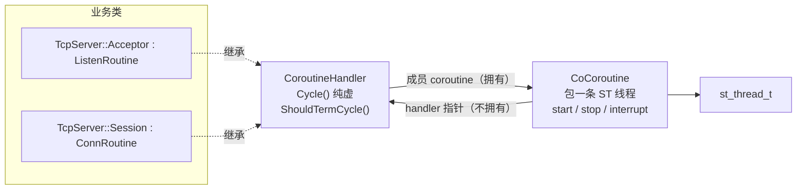
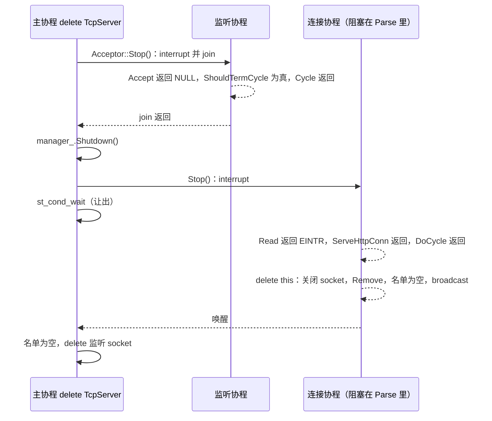

# State Threads 与 src/base 的实现

这篇讲两层东西：State Threads（ST）怎样让同步写法的 I/O 在阻塞时切走、就绪时切回；`src/base` 怎样在 ST 之上加一层所有权规则，让监听协程由调用方停止和释放，连接协程在自己的栈上释放自己。使用上的规则（业务代码该怎么写、哪些事不能做）见 [协程与连接管理](coroutine.md)。

相关代码：

- `thirdparty/st/sched.c`：创建、调度、中断、退出、join
- `thirdparty/st/io.c`：`st_read` / `st_write` / `st_poll`
- `thirdparty/st/sync.c`：`st_usleep`、条件变量
- `src/base/coroutine.hpp`、`src/base/coroutine.cpp`：`CoroutineHandler`、`CoCoroutine`、`ListenRoutine`、`ConnRoutine`
- `src/base/coroutine_mgr.hpp`、`src/base/coroutine_mgr.cpp`：`ConnManager`

## ST：协程怎么跑起来

### 创建：一段栈加一个上下文

`st_thread_create` 分配一段栈（`stk_size` 传 0 时用 `ST_DEFAULT_STACK_SIZE`，64KB），把线程控制块 `_st_thread_t` 和线程私有数据直接放在这段栈的顶端，入口设成 `_st_thread_main`，然后放进运行队列。

```c
sp = sp - (ST_KEYS_MAX * sizeof(void *));
ptds = (void **) sp;
sp = sp - sizeof(_st_thread_t);
thread = (_st_thread_t *) sp;
```

创建之后不会立即执行，要等当前协程让出，调度器才会轮到它。

`joinable` 参数只决定一件事：要不要给线程配一个终止条件变量 `term`，供 join 的一方等它结束。

### 切换：setjmp/longjmp 加运行队列

每次让出都是 `_ST_SWITCH_CONTEXT`：把当前寄存器存进 `thread->context`，调用 `_st_vp_schedule` 从运行队列取下一个协程，`longjmp` 过去。macOS 上的保存和恢复由 `md.S` 的 `_st_md_cxt_save` / `_st_md_cxt_restore` 完成，因为系统的 `setjmp` 会混淆栈指针。

```c
if (_ST_RUNQ.next != &_ST_RUNQ) {
    thread = _ST_THREAD_PTR(_ST_RUNQ.next);
    _ST_DEL_RUNQ(thread);
} else {
    /* If there are no threads to run, switch to the idle thread */
    thread = _st_this_vp.idle_thread;
}
thread->state = _ST_ST_RUNNING;
_ST_RESTORE_CONTEXT(thread);
```

运行队列为空时切到 idle 线程。idle 线程就是事件循环：`_ST_VP_IDLE()` 调用事件系统的 `dispatch`，在 epoll 或 kqueue 上等到 I/O 就绪或最近的超时到期，把对应协程放回运行队列，再切走。

`st_init()` 创建 idle 线程，并把调用它的那条线程登记为主协程（primordial thread）。主协程的栈就是进程原来的栈，不由 ST 分配。

### 阻塞 I/O 怎么变成让出

socket 都设成非阻塞。`st_read` 先直接 `read`，遇到 `EAGAIN` 再调 `st_netfd_poll`：

```c
while ((n = read(fd->osfd, buf, nbyte)) < 0) {
    if (errno == EINTR)
        continue;
    if (!_IO_NOT_READY_ERROR)
        return -1;
    /* Wait until the socket becomes readable */
    if (st_netfd_poll(fd, POLLIN, timeout) < 0)
        return -1;
}
```

`st_netfd_poll` 调用 `st_poll`，后者把这个 fd 加进事件系统，把协程挂到 I/O 等待队列，有超时就同时挂到超时堆，然后 `_ST_SWITCH_CONTEXT` 切走。fd 就绪后 idle 线程把它放回运行队列，`read` 重试。超时到期时 `st_poll` 返回 0，`st_netfd_poll` 把它翻译成 `ETIME`，`CocoSocket` 再翻译成 `ERROR_SOCKET_TIMEOUT`。

所以业务代码里同步写的 `conn_->Read()`，阻塞的只是当前这一条协程。

### 中断：一次性的标志

`st_thread_interrupt` 只做两件事：给目标协程设置 `_ST_FL_INTERRUPT`；如果它正在等待（I/O、sleep、条件变量），把它从等待队列里摘下来，放回运行队列。

```c
thread->flags |= _ST_FL_INTERRUPT;

if (thread->state == _ST_ST_RUNNING || thread->state == _ST_ST_RUNNABLE)
    return;

if (thread->flags & _ST_FL_ON_SLEEPQ)
    _ST_DEL_SLEEPQ(thread);

thread->state = _ST_ST_RUNNABLE;
_ST_ADD_RUNQ(thread);
```

它不会让出，调用方会继续往下执行。被中断的协程醒来时，或者在下一次阻塞调用的入口处，会检查这个标志，清掉它，返回 `-1` 并设置 `errno = EINTR`。`st_poll`、`st_usleep`、`st_cond_timedwait` 都是这样处理的。

标志只生效一次，被一次阻塞调用消耗掉就没了。协程拿到 `EINTR` 以后如果不退出，而是再次阻塞，就会一直等下去。

### 退出：可 join 与不可 join

协程函数返回后，`_st_thread_main` 调用 `st_thread_exit`：

```c
if (thread->term) {
    thread->state = _ST_ST_ZOMBIE;
    _ST_ADD_ZOMBIEQ(thread);
    st_cond_signal(thread->term);
    _ST_SWITCH_CONTEXT(thread);      /* 等 join 的一方把它叫回来 */
    st_cond_destroy(thread->term);
    thread->term = NULL;
}
_st_stack_free(thread->stack);       /* 交回空闲链表 */
_ST_SWITCH_CONTEXT(thread);          /* 再也不回来 */
```

- 可 join 的线程先变成僵尸，等 `st_thread_join` 把它叫回来之后，才继续释放栈。没有人 join 的话，这段栈会一直占着。
- 不可 join 的线程直接把栈交回空闲链表，然后切走。

两种情况下，栈都是在协程函数返回之后才释放的，而且从交回栈到切走之间没有任何分配操作。`src/base` 让连接在自己的栈上释放自己，依据就在这里。

`st_thread_join` 还有两条限制：不能 join 自己（返回 `EDEADLK`）；等待期间如果调用方被中断，会返回 `-1` / `EINTR`，而目标协程这时还没有退出。

## src/base 的三层



- `CoroutineHandler` 定义这条协程要做什么，也就是 `Cycle()`，同时提供 `ShouldTermCycle()`，让 `Cycle()` 查询自己是否该停下。
- `CoCoroutine` 负责怎么跑：创建、中断、join 一条 ST 线程，记录错误码和状态。
- `ListenRoutine` 和 `ConnRoutine` 是两套不同的所有权规则。

handler 拥有 `CoCoroutine`，`CoCoroutine` 又指回 handler。删掉 handler，协程对象也会跟着删掉。

### CoCoroutine 的状态

| 字段 | 含义 |
| --- | --- |
| `started` | `start()` 成功过，`trd_` 有效 |
| `interrupted` | 调用过 `st_thread_interrupt`；同一个对象只中断一次 |
| `disposed` | 外部 `stop()` 执行过；之后不能再 `start()` |
| `cycle_done` | `Cycle()` 已返回；之后 `interrupt()` 什么都不做 |
| `detached_` | 不可 join，`Cycle()` 返回后删除 handler |
| `trd_err_` | 协程的错误码；`interrupt()` 写入 `ERROR_THREAD_INTERRUPED` |

`ShouldTermCycle()` 读的是 `trd_err_`，只要它不等于 `COCO_SUCCESS` 就返回真：要么被中断了，要么 `Cycle()` 自己出了错。

`running()` 等价于 `started && !cycle_done`，`~CoCoroutine` 用它断言不可 join 的协程没有被外部提前删除。

## Cycle 是怎么被调用到的

以 `HttpServer` 上的一条连接为例，`HttpServer` 就是处理函数为 `ServeHttpConn` 的 `TcpServer`：

```text
TcpServer::Acceptor::Cycle()        监听协程
  new Session(server, conn)         构造：new CoCoroutine("conn", this)，set_detached(true)
  session->Start()
    CoCoroutine::start()
      st_thread_create(coroutine_fun, this, joinable=0, 0)   只放进运行队列
    manager_->Push(this)            登记到存活名单
  回到 Accept()，让出
                                    …… 调度器切到新协程 ……
_st_thread_main()                   ST 的入口
  coroutine_fun(CoCoroutine *)      静态函数，arg 就是 CoCoroutine *
    st_thread_setspecific           记下当前协程，供 CocoShouldStop() 查询
    CoCoroutine::cycle()
      生成协程 ID（CoroutineContext）
      handler->Cycle()              虚函数 → ConnRoutine::Cycle
        DoCycle()                   虚函数 → Session::DoCycle：可选 TLS 握手，然后调用处理函数
          ServeHttpConn(conn, handler)  真正的业务
        按返回值打日志，return
    记录错误码，cycle_done = true
    if (detached_) delete handler   连接在这里释放自己
    return NULL
st_thread_exit()                    交回栈，切走
```

`coroutine_fun` 必须是静态函数，因为 ST 只接受 C 风格的 `void *(*)(void *)`。它把 `void *` 转回 `CoCoroutine *`，再经 handler 的虚函数分派到业务代码。这里是两层模板方法：`ConnRoutine::Cycle()` 做通用的日志和错误归一，`DoCycle()` 留给派生类。`TcpServer::Session` 把 `DoCycle()` 再转成一次 `std::function` 调用，所以业务代码不用继承。

处理函数不是 `CoroutineHandler`，拿不到 `ShouldTermCycle()`。`coroutine_fun` 因此把当前的 `CoCoroutine *` 存进 ST 的线程私有数据（`CocoInit()` 里 `st_key_create` 创建的键），`CocoShouldStop()` 取出它，读的是同一个 `trd_err_`。

```cpp
void *CoCoroutine::coroutine_fun(void *arg) {
    CoCoroutine *p = (CoCoroutine *)arg;

    if (_coroutine_key >= 0) {
        st_thread_setspecific(_coroutine_key, p);
    }

    int err = p->cycle();

    if (_st_context) {
        _st_context->clear_cid();
    }
    if (_coroutine_key >= 0) {
        st_thread_setspecific(_coroutine_key, NULL);
    }

    if (err != COCO_SUCCESS) {
        p->trd_err_ = err;
    }
    p->cycle_done = true;

    if (p->detached_) {
        delete p->handler;
    }

    return NULL;
}
```

`delete p->handler` 之后 `p` 本身也已经释放（它是 handler 的成员），所以这之后只能直接返回。

监听协程走的是同一个入口，只是 `detached_` 为假：`Cycle()` 返回后什么都不删，线程变成僵尸，等调用方 join。

## 资源怎么释放

### 连接：Cycle 返回后在自己的栈上释放

`delete handler` 触发的析构顺序：

```text
~Session()           释放 conn_ → CocoSocket 析构 → st_netfd_close
                      DoCycle 已经返回，fd 上没有协程在等，close 一定成功
~ConnRoutine()
  delete coroutine    ~CoCoroutine → stop()：trd_ 就是当前线程，只 interrupt（cycle_done 为真，无操作），不 join
  manager_->Remove()  从存活名单删除；名单变空时 broadcast
```

`Remove` 放在最后，是因为它可能唤醒一个正在 `Shutdown()` 里等待的协程，那个协程醒来后可能会 `delete` manager。`Remove` 之后连接不再碰 manager。

析构函数里可以让出，比如关闭 TLS 时要写数据。这期间栈还在，其他协程照常运行。

从外部停止一个连接，只需要调用 `ConnRoutine::Stop()`，也就是 `interrupt()`。连接的下一次 I/O 返回 `EINTR`，`ShouldTermCycle()` 变真，`DoCycle()` 返回，然后走上面同一条释放路径。外部永远不 `delete` 一个已经启动的连接。

kqueue 版 ST 在 fd 上还有协程等待时，`st_netfd_close` 会失败，`CocoSocket` 析构里的断言会触发。以前连接由其他协程删除，派生类先关闭 socket，基类才去中断还阻塞在这个 socket 上的协程，就是这样出错的。

### 监听协程：调用方停止、调用方释放

`ListenRoutine` 是可 join 的，`CoCoroutine::stop()` 要等它真正退出：

```cpp
void CoCoroutine::stop() {
    if (disposed) {
        return;
    }

    if (trd_ && trd_ == st_thread_self()) {
        interrupt();
        return;
    }

    disposed = true;

    interrupt();

    if (trd_ && !detached_) {
        while (st_thread_join((st_thread_t)trd_, NULL) != 0) {
            if (errno != EINTR) {
                coco_error("join coroutine %s failed. errno=%d", name.c_str(), errno);
                break;
            }
        }
    }
    // ...
}
```

它区分三种情况：

- 从外部调用：先中断再 join。join 期间调用方自己被中断的话就重试，否则 `stop()` 返回后调用方会在协程还在运行时释放它。
- 在 `Cycle()` 里对自己调用：ST 不允许 join 自己，只中断。这时不设置 `disposed`，之后调用方 `delete` 时仍然会 join 一次。
- 从未启动：`trd_` 为空，不等待。

派生类必须在自己的析构函数开头调用 `Stop()`，因为 C++ 先执行派生类的析构函数。等到基类析构函数运行时，`Cycle()` 用到的成员已经没了。`TcpServer::Acceptor` 就是这样做的。`~TcpServer` 的顺序是：先停监听协程，保证它已经不在 `Accept` 里、不会再启动新连接；再 `manager_.Shutdown()`，等所有连接退出；最后 `delete` 监听 socket。

## 为什么需要 ConnManager

连接能释放自己以后，manager 已经不负责释放任何东西，但有两件事只能由它来做。

第一，找到所有连接。监听循环里 `new Session(...)` 之后调用 `Start()`，指针就丢掉了。关停时如果没有名单，没有任何地方知道还有哪些连接活着，也就无法中断它们。

第二，作为关停屏障，等所有连接退出。连接运行时会引用别人拥有的对象：`Session` 调用的是 `TcpServer` 的处理函数，处理函数里又用着交给 `HttpServer` 的 handler（通常是 mux），每个连接析构时还要调用 `manager_->Remove`。如果 `TcpServer` 析构时只中断连接就返回，这些连接醒来时，处理函数、handler 和 manager 都已经释放了。`Shutdown()` 保证这些对象在所有连接析构完之后才释放：

```cpp
void ConnManager::Shutdown() {
    if (conns.empty()) {
        return;
    }
    if (!cond_) {
        cond_ = st_cond_new();
    }

    std::vector<ConnRoutine *> live(conns.begin(), conns.end());
    for (auto conn : live) {
        conn->Stop();
    }

    while (!conns.empty()) {
        st_cond_wait(cond_);
    }
}
```

这段代码不会丢信号。ST 的条件变量不计数，没有等待者时 `signal` 会丢失。但 `Stop()` 只是中断、不让出，从检查名单为空到进入 `st_cond_wait` 之间没有让出点。别的连接只有在当前协程挂起之后才有机会执行 `Remove`，那时它一定已经在等了。

它也不怕被中断。调用 `Shutdown()` 的协程如果自己被中断，`st_cond_wait` 会提前返回，`while` 再检查一次名单，继续等。

删除一个还有连接的 `HttpServer`（也就是删除它持有的 `TcpServer`），完整的时序是：



以前的 manager 是连接真正的所有者：它要跑一条清理协程专门负责 `delete`，还要处理僵尸名单、丢信号，以及两处 `Destroy()` 同时进入的问题。现在它只剩一份存活名单加一个关停屏障。

## 约束

- `DoCycle()` 和 `TcpServer` 的处理函数都必须响应中断。中断标志只生效一次，`CoCoroutine::interrupted` 也只允许中断一次。拿到 `EINTR` 以后如果忽略它再去读，就会一直阻塞，`Shutdown()` 也会跟着一直等。循环条件里加上 `ShouldTermCycle()`（处理函数里用 `CocoShouldStop()`），出错就返回。
- 不能在某条连接里调用管理它的那个 manager 的 `Shutdown()`，也不能在连接里 `delete` 这个 manager：它会等所有连接退出，其中包括它自己。
- `CoroutineContext` 用全局的 `std::map<st_thread_t, int>` 存协程 ID，每次查询都查一次 map。`CocoShouldStop()` 已经改用 ST 自带的 `st_key_create` / `st_thread_setspecific`，协程 ID 还没有换过去。
- 一个进程只有一份 ST，跑在调用 `CocoInit()` 的那条内核线程上。要用满多核需要多进程，或者每个线程各自 `st_init()` 一份；所有对象都不能跨线程使用。

对应的测试在 `tests/coroutine_test.cpp`、`tests/tcp_server_test.cpp` 和 `tests/lifecycle_test.cpp`，跑法见 [构建](build.md) 的“测试”一节。
