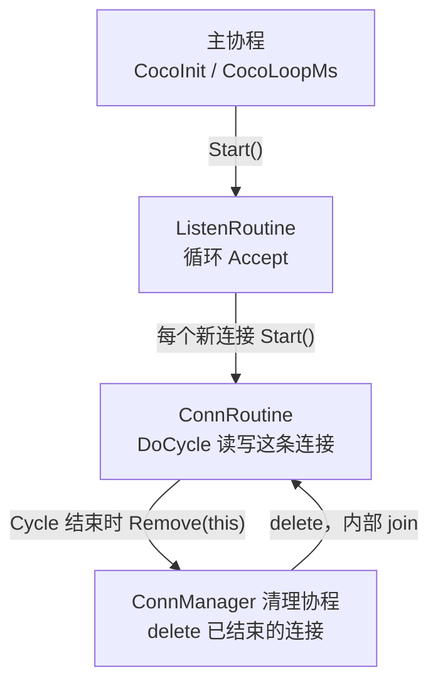

# 协程与连接管理

coco 的并发模型是：一个操作系统线程上跑很多栈式协程。阻塞点不进内核睡眠，而是让出当前协程，由 State Threads（ST）在 epoll（Linux）或 kqueue（macOS）上等到 I/O 就绪再切回来。业务代码写成普通的顺序调用。

相关代码：

- `src/base/coroutine.hpp`、`src/base/coroutine.cpp`：`CoCoroutine`、`ListenRoutine`、`ConnRoutine`
- `src/base/coroutine_mgr.hpp`、`src/base/coroutine_mgr.cpp`：`ConnManager`
- `src/net/coco_socket.cpp`：`st_read` / `st_write` 的封装
- `thirdparty/st`：调度、事件系统和上下文切换

## 一个线程，多段栈

`CocoInit()` 做三件事：

1. 确认当前系统有 epoll 或 kqueue。
2. `st_set_eventsys(ST_EVENTSYS_ALT)`，选 ST 在该平台上的高性能事件系统。
3. `st_init()`。调用 `st_init()` 的那条线程从此就是主协程，之后的 `st_thread_create` 都挂在这条线程上。

因此这是 1:N，不是每个协程一个内核线程，也没有把协程再分发到线程池。进程要吃满多核，需要多进程，或每个线程各自 `st_init()` 一份 ST。同一份 ST 不能跨线程使用。

每个协程有自己的栈。`CoCoroutine` 把 `stack_size` 传给 `st_thread_create`，`0` 表示用 ST 的默认大小（64KB）。上下文保存在 `jmp_buf` 形态的缓冲区里；macOS 上由 `thirdparty/st/md.S` 的 `_st_md_cxt_save` / `_st_md_cxt_restore` 保存被调用者保存寄存器和栈指针，因为系统 `setjmp` 会混淆这些值。

调度是协作式的。协程一直跑，直到调用会让出的 ST 函数：

| 调用 | 让出的时机 |
| --- | --- |
| `st_read` / `st_read_fully` / `st_recvfrom` | 套接字当前不可读 |
| `st_write` / `st_writev` / `st_sendto` | 发送缓冲区满 |
| `st_accept` | 监听套接字上没有新连接 |
| `st_connect` | 连接尚未完成 |
| `st_usleep` | `CocoSleepMs`、`CocoLoopMs` |
| `st_cond_wait` | 条件变量上没有信号 |
| `st_thread_join` | 目标协程还没退出 |

`CocoSocket` 把上述读写包成 `Read` / `Write`，并按超时把 `ETIME` 翻译成 `ERROR_SOCKET_TIMEOUT`。超时也是一次让出：到点后 ST 把该协程重新调度起来，读写返回错误。

主协程如果在 `main` 里空转而不让出，其他协程得不到运行。示例程序在启动监听协程之后调用 `CocoLoopMs()`，用 `st_usleep` 把主协程挂起，事件循环才能转起来。

## 两类协程



`ListenRoutine` 和 `ConnRoutine` 都是 `CoroutineHandler`。真正的 ST 线程放在 `CoCoroutine` 里：`start()` 调用 `st_thread_create(coroutine_fun, ..., joinable=1, stack_size)`。入口函数调用 `handler->Cycle()`，返回后把错误码留在协程对象上，供 `join` 的一方读取。

监听协程的 `Cycle()` 是一个循环：

```text
while (true) {
    conn = listener->Accept();   // st_accept，没有连接就让出
    new XxxServer(manager, conn)->Start();
}
```

`Accept()` 返回后，监听协程只负责 `new` 和 `Start()`，然后立刻回到 `Accept()`。单条连接上的读、写、协议解析都在这条连接自己的协程里，通过 `DoCycle()` 完成。`HttpServer`、TCP pingpong 都是这个结构。

`ConnRoutine` 构造时做两件事：创建名为 `"conn"` 的 `CoCoroutine`，并 `manager_->Push(this)`。`Start()` 之后 ST 会调度到 `Cycle()`：

```text
ret = DoCycle();
把对端正常关闭归一成 ERROR_SOCKET_CLOSED;
manager_->Remove(this);   // 此时协程还在自己的栈上
return;
```

`DoCycle()` 里看到 `ShouldTermCycle()` 为真就应退出。该标志来自 `CoCoroutine::pull()`，也就是 `interrupt()` 写下的 `trd_err_`。

## 连接不能释放自己

`Remove(this)` 发生时，调用栈大致是：

```text
ST 栈帧
  coroutine_fun
    CoCoroutine::cycle
      ConnRoutine::Cycle
        HttpServerConn::DoCycle     // 已经返回
        ConnManager::Remove
```

对象的成员、`DoCycle` 的局部变量都在这段栈上。`delete this` 会进入 `~ConnRoutine()`，后者 `interrupt` 并 `delete` 协程对象，`~CoCoroutine()` 再 `st_thread_join` 自己。自己 join 自己没有意义，而且析构会把正在使用的栈释放掉。

所以 `Remove` 只做移交：

1. 从 `conns` 移到 `zombies`。
2. 必要时创建清理协程。
3. `st_cond_signal`，然后返回。

连接协程接着从 `Cycle()` 和 `coroutine_fun` 返回，ST 才认为这条协程结束。清理协程随后 `delete` 这个对象。析构里的 `st_thread_join` 此时要么立刻成功（协程已经退出），要么让出清理协程，直到目标协程退出后再继续释放。栈的释放发生在协程函数返回之后。

这也是清理协程要单独存在的原因。以前 `Destroy()` 写在下一次 `Accept()` 之前：没有新连接，已结束的连接就不会被 `delete`，套接字也不关闭。握手失败的服务端会一直占着连接，对端阻塞在读上。

## ConnManager

`ConnManager` 有两份名单：

- `conns`：`Push` 进来、`Cycle` 尚未结束的连接。
- `zombies`：`Remove` 过、等待 `delete` 的连接。

清理协程和条件变量在第一次 `Remove` 时创建。`Remove` 一定运行在某条连接协程里，此时 `st_init()` 已经完成，可以安全调用 `st_cond_new` 和 `st_thread_create`。服务端一个监听循环配一个 `ConnManager`（`HttpServer`、pingpong 都是这样）。WebSocket 客户端同样用它管理自己的连接协程。

清理循环：

```text
while (!quit) {
    if (zombies 为空)
        st_cond_wait(cond);    // 没活干才等，避免丢掉信号
    if (quit)
        break;
    Destroy();
}
```

ST 的条件变量不计数。清理协程正在 `Destroy()` 里时发来的 `st_cond_signal` 没有等待者，信号会丢。因此等在循环顶部，而且只在名单已经空的时候等。`Destroy()` 返回后如果期间又有新的僵尸，下一轮直接清理，不再依赖那次丢失的信号。

`Destroy()` 先把 `zombies` 换到局部向量里再逐个 `delete`：

```text
dead.swap(zombies);
for (conn : dead)
    delete conn;    // ~ConnRoutine -> join，可能让出
```

`delete` 里的 `join` 会让出清理协程。若在让出期间仍用成员 `zombies` 遍历，并发的另一次 `Destroy()` 可能删到同一个指针。换走之后，成员名单只接收新的 `Remove`，这次要释放的集合不再变化。当前只有清理协程和析构函数调用 `Destroy()`，析构会先把清理协程 `join` 掉，两者不会同时进 `Destroy()`；换走名单把这个不变量留在函数里面，而不是依赖调用方。

析构顺序：

1. `quit_ = true`，`st_thread_interrupt` 清理协程并 `st_thread_join` 它。清理协程若正堵在 `st_cond_wait`，中断使其返回，看到 `quit_` 后退出。`cleanup_trd_` 随后置空。
2. `Destroy()` 清掉此时已经在列的僵尸。
3. `delete` 仍在 `conns` 里的连接。析构里的 `interrupt` 让这些协程的 I/O 返回，`Cycle` 再调用 `Remove`。
4. `st_cond_destroy`。

第 3 步有一个关停窗口。`Remove` 看到 `cleanup_trd_` 已经为空，会再创建一条清理协程去 `delete` 这个连接，而步骤 3 的 `delete` 还没返回。正常收包路径不经过这里：连接都是自己 `Remove`，由当时那条清理协程释放。`HttpServer` 的析构发生在进程退出时，文件描述符会随进程一起关掉。

## 和业务代码的边界

业务侧继承 `ConnRoutine`，实现 `DoCycle()` 和 `GetRemoteAddr()`。`DoCycle()` 里的 `Read` / `Write` 可以按同步代码来写，该让出的时候 ST 会让出。循环条件加上 `ShouldTermCycle()`，这样 `Stop()` 或析构里的 `interrupt` 能在下一次 I/O 返回后结束循环。

`Cycle()` 末尾的 `Remove(this)` 由基类调用，派生类不要自己 `delete` 连接，也不要在 `DoCycle()` 里 `delete this`。监听循环也不再需要在 `Accept()` 前调用 `Destroy()`，回收由 `ConnManager` 的清理协程完成。
