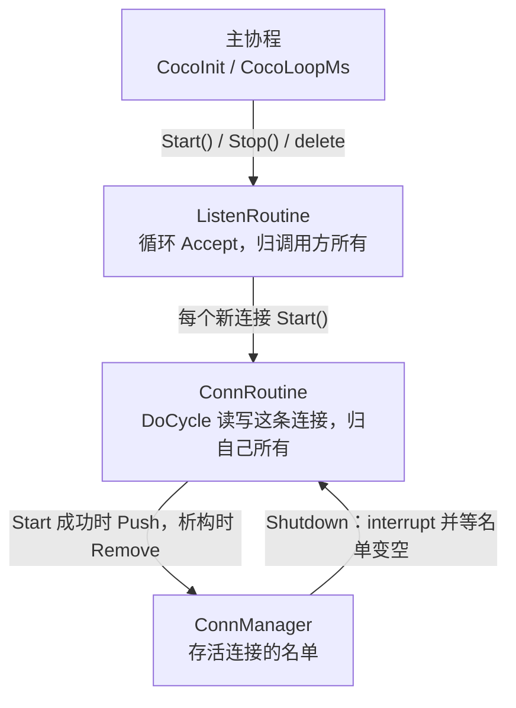

# 协程与连接管理

coco 的并发模型是：一个操作系统线程上跑很多栈式协程。阻塞点不进内核睡眠，而是让出当前协程，由 State Threads（ST）在 epoll（Linux）或 kqueue（macOS）上等到 I/O 就绪再切回来。业务代码写成普通的顺序调用。

这篇讲使用规则。ST 内部怎么调度、`Cycle()` 怎么被调用到、`CoCoroutine` 各个状态字段的含义，见 [State Threads 与 src/base 的实现](st.md)。

相关代码：

- `src/base/coroutine.hpp`、`src/base/coroutine.cpp`：`CoCoroutine`、`ListenRoutine`、`ConnRoutine`
- `src/base/coroutine_mgr.hpp`、`src/base/coroutine_mgr.cpp`：`ConnManager`
- `src/net/coco_socket.cpp`：`st_read` / `st_write` 的封装
- `src/server/coco_tcp_server.cpp`：`TcpServer`，把下文的监听循环和连接协程组装好
- `thirdparty/st`：调度、事件系统和上下文切换
- `tests/coroutine_test.cpp`、`tests/tcp_server_test.cpp`、`tests/lifecycle_test.cpp`：下文每条生命周期规则对应的测试

## 一个线程，多段栈

`CocoInit()` 做三件事：

1. 确认当前系统有 epoll 或 kqueue。
2. `st_set_eventsys(ST_EVENTSYS_ALT)`，选 ST 在该平台上的高性能事件系统。
3. `st_init()`。调用 `st_init()` 的那条线程从此就是主协程，之后的 `st_thread_create` 都挂在这条线程上。

因此这是 1:N，不是每个协程一个内核线程，也没有把协程再分发到线程池。进程要吃满多核，需要多进程，或每个线程各自 `st_init()` 一份 ST。同一份 ST 不能跨线程使用。

每个协程有自己的栈。`CoCoroutine` 把 `stack_size` 传给 `st_thread_create`，`0` 表示用 ST 的默认大小（64KB）。上下文保存在 `jmp_buf` 形态的缓冲区里；macOS 上由 `thirdparty/st/md.S` 的 `_st_md_cxt_save` / `_st_md_cxt_restore` 保存被调用者保存寄存器和栈指针，因为系统 `setjmp` 会混淆这些值。

调度是协作式的。协程一直跑，直到调用会让出的 ST 函数：

| 调用 | 让出的时机 |
| --- | --- |
| `st_read` / `st_read_fully` / `st_recvfrom` | 套接字当前不可读 |
| `st_write` / `st_writev` / `st_sendto` | 发送缓冲区满 |
| `st_accept` | 监听套接字上没有新连接 |
| `st_connect` | 连接尚未完成 |
| `st_usleep` | `CocoSleepMs`、`CocoLoopMs` |
| `st_cond_wait` | 条件变量上没有信号 |
| `st_thread_join` | 目标协程还没退出 |

`CocoSocket` 把上述读写包成 `Read` / `Write`，并按超时把 `ETIME` 翻译成 `ERROR_SOCKET_TIMEOUT`。超时也是一次让出：到点后 ST 把该协程重新调度起来，读写返回错误。

主协程如果在 `main` 里空转而不让出，其他协程得不到运行。示例程序在启动监听协程之后调用 `CocoLoopMs()`，用 `st_usleep` 把主协程挂起，事件循环才能转起来。

## 两类协程，两种归属



`ListenRoutine` 和 `ConnRoutine` 都是 `CoroutineHandler`。真正的 ST 线程放在 `CoCoroutine` 里，入口函数 `coroutine_fun` 调用 `handler->Cycle()`，错误码留在 `trd_err_` 上。两类协程的区别在于谁负责释放：

| | `ListenRoutine` | `ConnRoutine` |
| --- | --- | --- |
| ST 线程 | 可 join | 不可 join（`set_detached(true)`） |
| 谁 `delete` | 调用方 | 自己的协程，`Cycle()` 返回之后 |
| `Stop()` | 中断并等 `Cycle()` 返回 | 只中断，不等 |

监听协程的 `Cycle()` 是一个循环：

```text
while (!ShouldTermCycle()) {
    conn = listener->Accept();   // st_accept，没有连接就让出
    if (conn == NULL) {
        if (ShouldTermCycle()) break;   // 被 Stop() 中断
        sleep 10ms; continue;           // EMFILE 之类的错误不会阻塞，不退让会饿死其他协程
    }
    c = new XxxServer(manager, conn);
    if (c->Start() != OK) delete c;     // 没启动起来，仍归这里所有
}
```

中断后 `Accept()` 会立刻返回空。循环不检查 `ShouldTermCycle()` 的话，这条协程会一直空转，从不让出，`Stop()` 里的 join 也就永远等不到它退出。

## 连接在自己的栈上释放自己

连接协程结束时，入口函数这样收尾：

```text
coroutine_fun(p):
    err = p->cycle();          // ConnRoutine::Cycle -> DoCycle
    p->cycle_done = true;
    if (p->detached_)
        delete p->handler;     // ~XxxServer -> ~ConnRoutine -> ~CoCoroutine
    return NULL;
```

`delete` 发生时，调用栈还在这条协程自己的栈上。这是安全的，因为 ST 对不可 join 的线程是在 `st_thread_exit` 里、也就是协程函数返回之后，才把栈交回空闲链表（`thirdparty/st/sched.c`）。在那之前，析构函数可以照常用这段栈，甚至可以让出，比如关闭 TLS 时要写数据。

以前的设计认为“连接不能释放自己”，是因为 `~CoCoroutine` 会 join 自己：ST 对自 join 直接返回 `EDEADLK`，旧代码又会解引用 join 的返回值。现在 `CoCoroutine::stop()` 发现调用方就是协程本身时，只做 `interrupt`，不 join；不可 join 的协程也从不 join。释放和停止分成了两条路径：

- **释放**：只由连接自己的协程在入口函数末尾完成。
- **停止**：`ConnRoutine::Stop()` 只调用 `interrupt()`。之后的第一次阻塞调用返回 `EINTR`，`ShouldTermCycle()` 变为真，`DoCycle()` 返回，连接随即释放自己。

析构的顺序也就固定下来：派生类析构函数运行时，`DoCycle()` 一定已经返回。不会再出现“派生类先释放了 socket，基类才去中断还阻塞在这个 socket 上的协程”。kqueue 版 ST 在 fd 上仍有等待者时，`st_netfd_close` 会失败，`Layer4Conn` 析构里的断言以前就是这样被触发的。

由此得到三条规则：

1. `Start()` 成功以后，任何其他代码都不能 `delete` 这个连接。`~CoCoroutine` 用断言检查这一点。
2. `Start()` 失败时，对象仍归调用方，调用方负责 `delete`。
3. 在连接之外保存它的指针，必须在连接析构时收到通知。`WebSocketClient` 的做法是：`~WebSocketConn` 调用 `OnConnClosed()`，客户端把 `conn_` 置空并标记为已关闭，之后 `Send` 返回 `ERROR_WS_CLOSED`，而不是访问已经释放的对象。
4. 其他协程也会用到的资源，不能由自行释放的连接来释放。WebSocket 的写可以发生在用户自己的协程里，所以 socket 归 `WebSocketClient`，不归读协程 `WebSocketConn`：读协程退出时如果还有协程阻塞在 `Send` 的写上，socket 由最后一个写完的协程关闭。否则关闭一个仍有协程在等待的 fd，`st_netfd_close` 会失败。

## ConnManager

`ConnManager` 不再释放任何东西，只维护一份存活连接的名单：

- `Push`：`ConnRoutine::Start()` 成功时调用。
- `Remove`：`~ConnRoutine` 的最后一步调用。名单变空时 `st_cond_broadcast`。
- `Shutdown`：先对名单里每个连接调用 `Stop()`，再 `st_cond_wait` 直到名单变空。
- 析构函数：调用 `Shutdown()`，然后销毁条件变量。

所以 `ConnManager` 必须比登记在它上面的连接活得久，而析构函数正好会等到它们都退出。`TcpServer` 的关停顺序因此是：先停监听协程，再 `manager_.Shutdown()`（等所有连接退出，它们用到的处理函数和 mux 此时还在），最后 `delete` 监听 socket。`HttpServer` 只是持有一个 `TcpServer`，顺序相同。

`Shutdown` 的等待循环不会丢信号：

```text
for (conn : 名单的副本) conn->Stop();   // interrupt 不让出
while (!名单为空)
    st_cond_wait(cond);
```

在检查名单和进入 `st_cond_wait` 之间没有任何让出点，所以最后那次 `Remove` 只可能发生在 `Shutdown` 已经挂在条件变量上的时候。如果 `Shutdown` 所在的协程自己被中断了，`st_cond_wait` 会提前返回，循环再等一轮。`CoCoroutine::stop()` 的 join 也是同样的处理：遇到 `EINTR` 就重试，否则提前返回会在协程还在跑的时候释放它。

`Shutdown` 不能在它管理的某条连接里调用，否则会等自己退出。它结束后 `ConnManager` 仍然可以继续使用。

## 和业务代码的边界

写服务端时，通常不需要继承任何类。`src/server/coco_tcp_server.hpp` 的 `TcpServer` 已经包含上面的监听循环、连接的 `ConnRoutine` 和 `ConnManager`，业务只提供一个处理函数 `int(StreamConn &conn)`。处理函数运行在连接协程上，里面的 `Read` / `Write` 按同步代码来写，该让出的时候 ST 会让出。收到中断后，处理函数必须尽快返回：I/O 出错时不要吞掉错误继续阻塞；不做 I/O 的循环用 `CocoShouldStop()` 判断，它对当前协程的作用和 `ShouldTermCycle()` 相同。`TcpServer::Stop()` 要等所有处理函数返回才会返回，所以不能在处理函数里调用它。

需要自己控制 accept 或连接对象时，再继承 `ConnRoutine`，实现 `DoCycle()` 和 `GetRemoteAddr()`，循环条件里加上 `ShouldTermCycle()`。`Shutdown` 和监听协程的 `Stop()` 同样要等 `DoCycle()` 返回。

继承 `ListenRoutine` 的类，要在自己的析构函数开头调用 `Stop()`。基类析构函数运行时，派生类的成员已经释放了，在那里停协程为时已晚。`TcpServer` 内部的监听协程也是这样做的。
